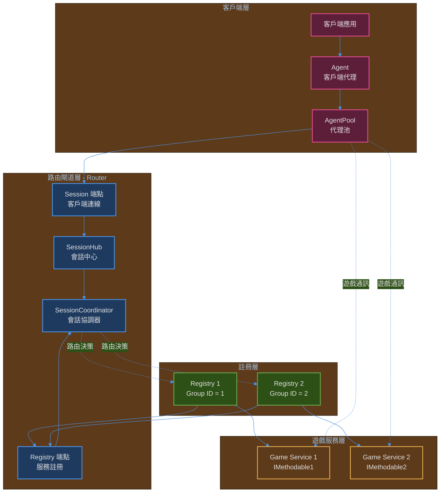
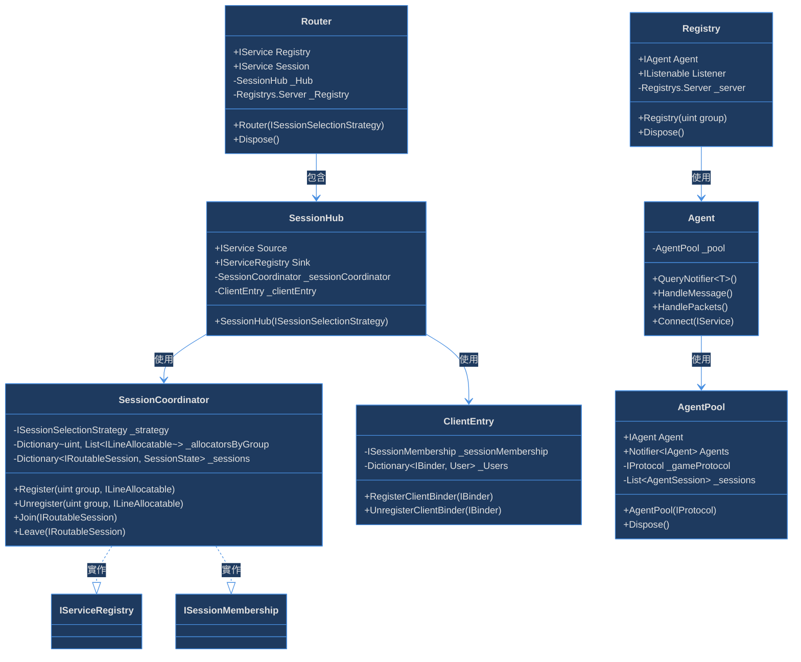
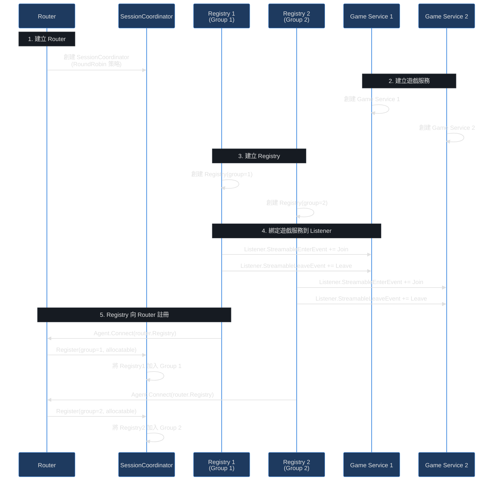
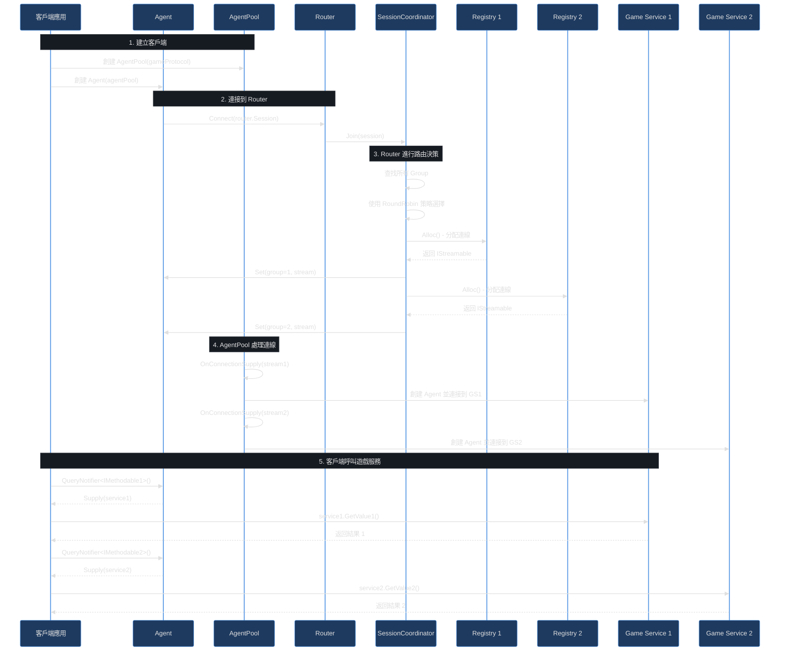
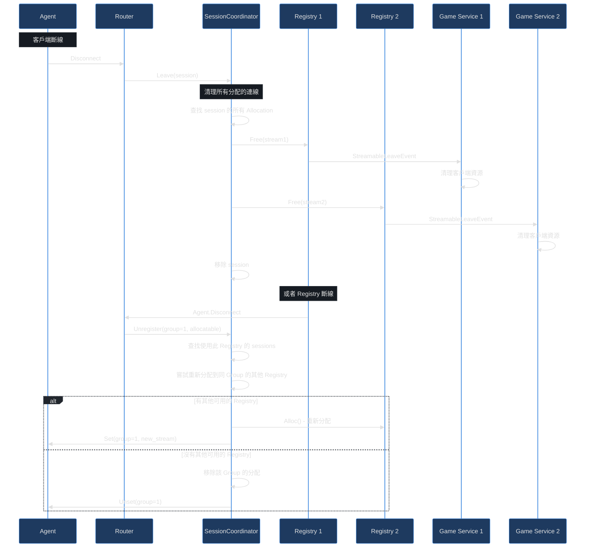

# PinionCore.Remote.Gateway

## 概述

PinionCore.Remote.Gateway 是一個分散式遊戲服務閘道系統，提供客戶端與多個遊戲服務之間的智慧路由與連線管理。它採用三層架構設計，讓客戶端能夠透過單一連接點同時與多個遊戲服務通訊，而無需關心底層的連線細節。

## 核心概念

Gateway 系統由三個主要組件組成：

### 1. Router (路由閘道)
作為中央協調者，負責：
- 接收遊戲服務的註冊（透過 Registry 端點）
- 接收客戶端連線（透過 Session 端點）
- 根據策略將客戶端路由到對應的遊戲服務
- 管理多個遊戲服務的生命週期
- **支援多協議版本並存**：自動識別並隔離不同協議版本的客戶端與服務

### 2. Registry (註冊中心)
作為遊戲服務的註冊代理，負責：
- 向 Router 註冊自己的 Group ID 與協議版本
- 提供 Listener 給遊戲服務，用於接收玩家連線
- 管理遊戲服務與 Router 之間的通訊

### 3. Agent (客戶端代理)
作為玩家客戶端，負責：
- 連接到 Router 的 Session 端點並提供協議版本資訊
- 透過 AgentPool 管理多個遊戲服務的連線
- 使用 CompositeNotifier 整合多個遊戲服務的介面
- 提供統一的 API 給上層應用

## 架構圖

### 整體架構



### 組件詳細架構




## 時序圖

### 啟動與註冊流程



### 客戶端連線與通訊流程



### 斷線處理流程



## 快速開始

### 1. 安裝

透過 NuGet 安裝套件：

```bash
dotnet add package PinionCore.Remote.Gateway
```

### 2. 建立 Router

```csharp
using PinionCore.Remote.Gateway;

// 建立 Router
using var router = new Router();

// router.Registry - 供遊戲服務註冊使用
// router.Session - 供客戶端連接使用
```

### 3. 建立遊戲服務與 Registry

```csharp
using PinionCore.Remote.Gateway;
using PinionCore.Remote.Soul;

// 建立遊戲服務
public class MyGameEntry : IEntry
{
    void IBinderProvider.RegisterClientBinder(IBinder binder)
    {
        // 綁定遊戲服務介面
        binder.Bind<IMyGameService>(this);
    }

    void IBinderProvider.UnregisterClientBinder(IBinder binder)
    {
        // 清理
    }

    void IEntry.Update()
    {
        // 遊戲邏輯更新
    }
}

// 建立服務
var gameEntry = new MyGameEntry();
var gameService = PinionCore.Remote.Standalone.Provider.CreateService(
    gameEntry,
    protocol
);

// 建立 Registry (使用 Group ID = 1)
var registry = new Registry(1);

// 啟動 Agent Worker (處理訊息)
var registryWorker = new AgentWorker(registry.Agent);

// 綁定遊戲服務到 Listener
registry.Listener.StreamableEnterEvent += gameService.Join;
registry.Listener.StreamableLeaveEvent += gameService.Leave;

// 連接到 Router
registry.Agent.Connect(router.Registry);
```

### 4. 建立客戶端

```csharp
using PinionCore.Remote.Gateway;
using PinionCore.Remote.Gateway.Hosts;

// 建立 Agent (需要提供遊戲協議)
var agent = new Agent(new AgentPool(gameProtocol));

// 啟動 Agent Worker
var agentWorker = new AgentWorker(agent);

// 連接到 Router
agent.Connect(router.Session);

// 使用 Agent 查詢遊戲服務
var notifier = agent.QueryNotifier<IMyGameService>();

// 監聽服務供應
notifier.Supply += (service) =>
{
    // 可以開始使用 service
    var result = await service.GetData().RemoteValue();
};

// 處理訊息 (在遊戲迴圈中)
agent.HandleMessage();
agent.HandlePackets();
```

## 完整範例

參考測試檔案 `PinionCore.Remote.Gateway.Test/Tests.cs` 中的 `GatewayRegistryAgentIntegrationTestAsync` 方法，這是一個完整的使用範例，展示了：

1. 如何建立 Router
2. 如何建立多個遊戲服務
3. 如何建立多個 Registry 並註冊到 Router
4. 如何建立客戶端並同時與多個遊戲服務通訊

## API 說明

### Router

```csharp
public class Router : IDisposable
{
    // 供遊戲服務註冊使用的端點
    public readonly IService Registry;

    // 供客戶端連接使用的端點
    public readonly IService Session;

    public Router(ISessionSelectionStrategy strategy);
    public void Dispose();
}
```

### Registry

```csharp
public class Registry : IDisposable
{
    // 用於連接到 Router 的 Agent
    public readonly IAgent Agent;

    // 供遊戲服務監聽玩家連線的 Listener
    public readonly IListenable Listener;

    // group - 用於 Router 路由決策的群組 ID
    public Registry(uint group);

    public void Dispose();
}
```

### Agent

```csharp
public class Agent : IAgent
{
    // 建立 Agent
    // pool - AgentPool，用於管理多個遊戲服務的連線
    public Agent(AgentPool pool);

    // 查詢遊戲服務介面的 Notifier
    INotifier<T> QueryNotifier<T>();

    // 處理訊息 (需在遊戲迴圈中定期呼叫)
    void HandleMessage();
    void HandlePackets();

    // 連接/斷線
    void Enable(IStreamable streamable);
    void Disable();
}
```

### AgentPool

```csharp
public class AgentPool : IDisposable
{
    // 內部 Agent，用於連接到 Router
    public IAgent Agent { get; }

    // 遊戲服務的 Agent 集合
    public Notifier<IAgent> Agents { get; }

    // gameProtocol - 遊戲協議
    public AgentPool(IProtocol gameProtocol);

    public void Dispose();
}
```

## 進階主題

### 自訂路由策略

Router 預設使用 `RoundRobinSelector` 進行路由，您可以實作 `ISessionSelectionStrategy` 介面來自訂路由邏輯：

```csharp
public interface ISessionSelectionStrategy
{
    IEnumerable<Registrys.ILineAllocatable> OrderAllocators(uint group, IReadOnlyList<Registrys.ILineAllocatable> allocators);
}
```

範例：

```csharp
public class CustomStrategy : ISessionSelectionStrategy
{
    public IEnumerable<Registrys.ILineAllocatable> OrderAllocators(uint group, IReadOnlyList<Registrys.ILineAllocatable> allocators)
    {
        // 自訂選擇邏輯，例如：
        // - 基於負載
        // - 基於地理位置
        // - 基於玩家偏好
        return allocators.OrderBy(a => a.AllocatedCount);
    }
}

// 使用自訂策略
var router = new Router(new CustomStrategy());
```

### Group ID 的使用

Group ID 是一個重要的概念，用於區分不同的遊戲服務類型或分區：

- **相同 Group ID**: 代表相同類型的服務，Router 會使用策略選擇其中一個
- **不同 Group ID**: 代表不同類型的服務，Router 會將客戶端路由到所有 Group

範例：
```csharp
// 服務類型 A (Group 1)
var registryA = new Registry(1);

// 服務類型 B (Group 2)
var registryB = new Registry(2);

// 客戶端連接後，會同時與類型 A 服務和類型 B 服務建立連線
```

### 協議版本管理

Gateway 支援多個協議版本同時運行，這對於需要逐步升級的系統特別重要：

#### 版本隔離機制

Router 會根據 `IProtocol.VersionCode` 自動隔離不同版本的客戶端與服務：

```csharp
// 舊版本服務
var oldProtocol = OldProtocolCreator.Create(); // VersionCode = [1, 0, 0]
var registryV1 = new Registry(oldProtocol, groupId: 1);

// 新版本服務
var newProtocol = NewProtocolCreator.Create(); // VersionCode = [2, 0, 0]
var registryV2 = new Registry(newProtocol, groupId: 1);

// 兩者可同時向同一個 Router 註冊
registryV1.Agent.Connect(router.Registry);
registryV2.Agent.Connect(router.Registry);

// 使用舊版本協議的客戶端只會路由到 registryV1
// 使用新版本協議的客戶端只會路由到 registryV2
```

#### 版本升級策略

1. **藍綠部署**：
   - 同時部署新舊版本服務
   - 逐步將客戶端升級到新版本
   - 確認穩定後移除舊版本服務

2. **金絲雀發布**：
   - 新版本服務使用不同的 Group ID
   - 部分客戶端連接到新版本進行測試
   - 驗證無誤後全面切換

3. **版本相容性檢查**：
   ```csharp
   // 在 Registry 建立時指定協議版本
   var protocol = ProtocolCreator.Create();
   var registry = new Registry(protocol, groupId: 1);

   // Router 會自動使用 protocol.VersionCode 進行版本隔離
   // 確保只有相同版本的客戶端能連接到對應的服務
   ```

### 使用 Reactive Extensions (Rx)

Gateway 整合了 Reactive Extensions，讓您可以使用流式處理方式處理遊戲服務：

```csharp
// 使用 LINQ 查詢遊戲服務
var observable = from service in agent.QueryNotifier<IMyService>().SupplyEvent()
                 from result in service.GetData().RemoteValue()
                 select result;

var data = await observable.FirstAsync();
```

### 網路模式 vs 單機模式

範例使用的是 Standalone 模式（單機模式），適合開發和測試。生產環境應使用網路模式：

```csharp
// 網路模式 - Server
var service = Provider.CreateTcpService(entry, protocol, port);

// 網路模式 - Client
var agent = Provider.CreateTcpAgent(protocol);
agent.Connect(host, port);
```

## 注意事項

1. **Worker 的重要性**: Registry 和 Agent 都需要使用 `AgentWorker` 來處理訊息，確保定期呼叫 `HandleMessage()` 和 `HandlePackets()`

2. **資源釋放**: 所有組件都實作了 `IDisposable`，請確保適當釋放資源

3. **Group ID 規劃**: 合理規劃 Group ID 可以讓路由更有效率，避免不必要的連線

4. **策略選擇**: 選擇適合的路由策略可以提升系統效能和玩家體驗

5. **錯誤處理**: 監聽 Agent 的錯誤事件以處理網路異常：
   ```csharp
   agent.ExceptionEvent += (ex) => Console.WriteLine($"Error: {ex}");
   agent.ErrorMethodEvent += (method, msg) => Console.WriteLine($"Method Error: {method} - {msg}");
   ```

## 相關資源

- [PinionCore.Remote 核心文件](../README.md)
- [Protocol 程式碼產生器](../PinionCore.Remote.Tools.Protocol.Sources/README.md)
- [範例專案](../PinionCore.Samples.HelloWorld.Client/README.md)

## 授權

MIT License
