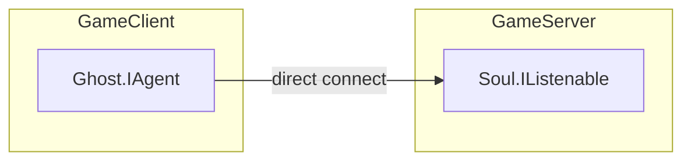
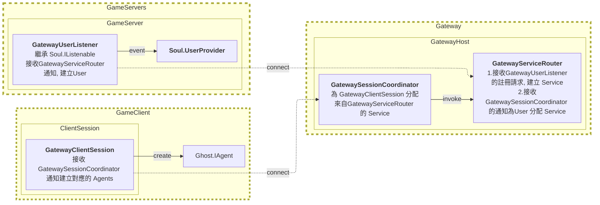
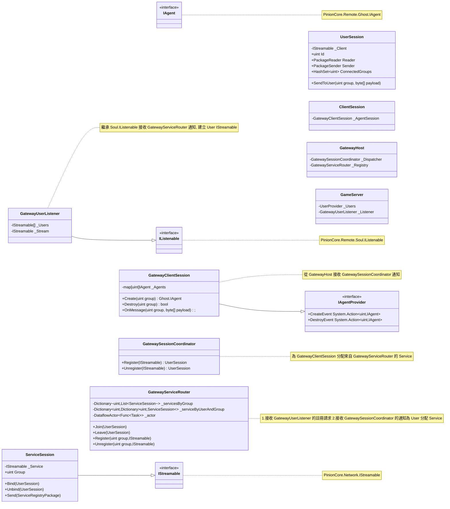
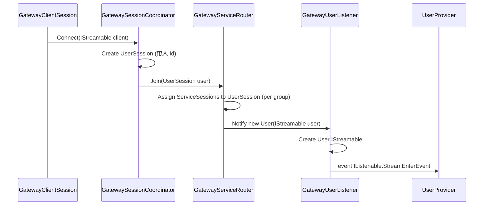
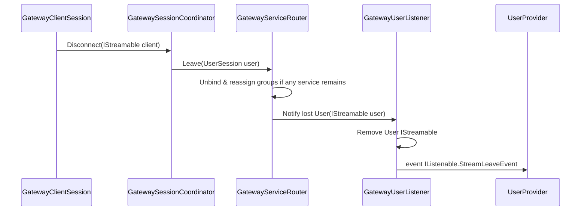
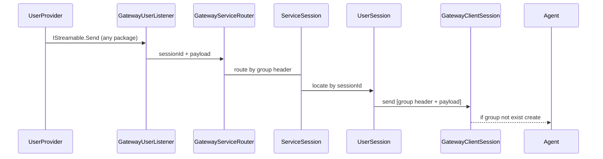

# Gateway Architecture

在真實的環境中為了避免曝光遊戲伺服器的 IP 位址, 會在遊戲伺服器前端加上一層 Gateway 來處理 Client 的連線請求,
以 PinionCore Remote 來說從原先的建立 Agent 直接連線到 GameServer, 變成建立 GatewayClientSession 連線到 Gateway 再由 Gateway 分配已經註冊的遊戲服務給 GatewayClientSession, GatewayClientSession 再建立對應的 Agent 與 GameServer 互動。

## 架構修改

這是原本的架構, Client 直接建立 Agent 連線到 GameServer

目標修改後的架構, Client 建立 GatewayClientSession 連線到 Gateway, Gateway 把已經註冊的服務分配給 GatewayClientSession, GatewayClientSession 再建立對應的 Agent 與 GameServer 互動。

## 類別圖

### GatewayServiceRouter 行為補充

- `UserSession` 由 `GatewaySessionCoordinator` 建立時即帶入唯一的 `Id`，與 `GatewayUserListener.User` 的 Id 對應，`GatewayServiceRouter` 僅依此 Id 維護狀態，不再重新分配。
- `Join(UserSession)` 會在單一 `DataflowActor` 執行緒上處理，針對目前註冊的每一個 group 選擇負載最低的 `ServiceSession` 並送出 `Join` 封包，封包中的 `UserId` 等於 `UserSession.Id`。
- User 與 Service 間的資料在傳遞時會在 payload 前方增加 4 bytes little-endian 的 group header；Gateway 端、`GatewayServiceRouter` 與 `UserSession` 都依據此 header 進行路由。
- `Register` 新服務時計算所有尚未在該 group 建立連線的 `UserSession`，立即補發 Join；`Unregister` 會將受影響的使用者重新指派到現存服務，若目前無可用服務則留下 TODO 以後處理。

## 時序圖

### GatewayClientSession 連線流程

### GatewayClientSession 斷線流程

### GatewayClientSession 建立 Agent 流程

### 
