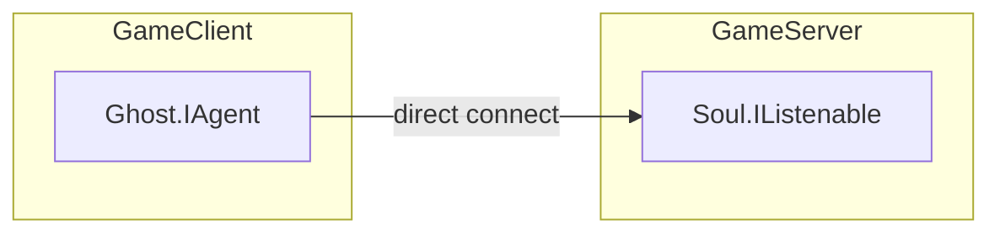
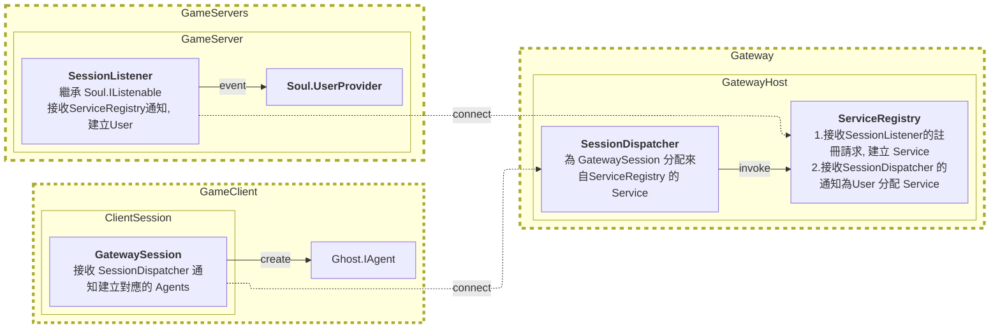
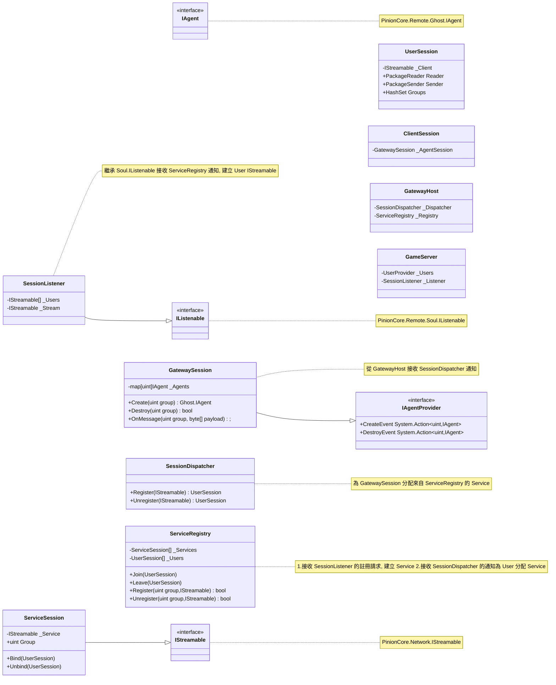
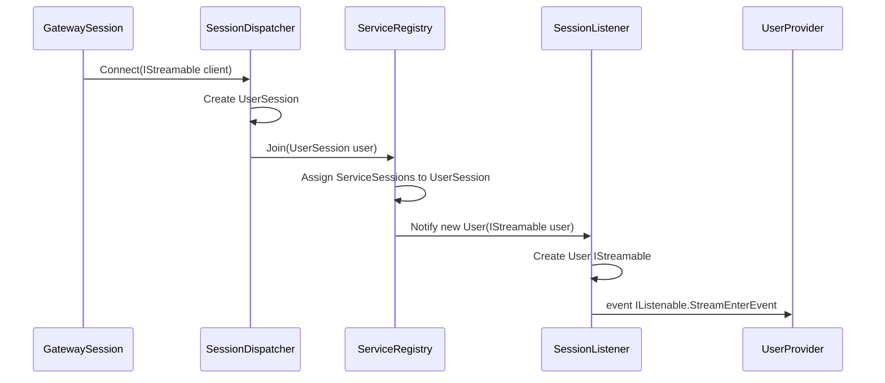
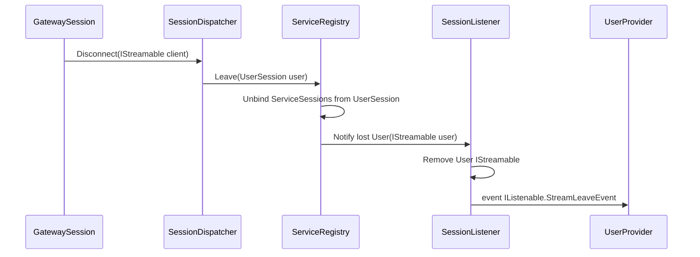
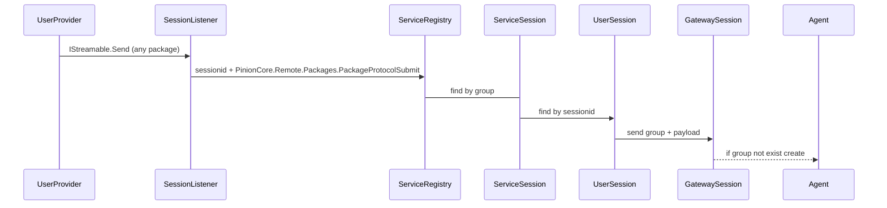


# Gateway Architecture

在真實的環境中為了避免曝光遊戲伺服器的 IP 位址, 會在遊戲伺服器前端加上一層 Gateway 來處理 Client 的連線請求,
以 PinionCore Remote 來說從原先的建立 Agent 直接連線到 GameServer, 變成建立 GatewaySession 連線到 Gateway 再由 Gateway 分配已經註冊的遊戲服務給 GatewaySession, GatewaySession 再建立對應的 Agent 與 GameServer 互動。

## 架構修改

這是原本的架構, Client 直接建立 Agent 連線到 GameServer

目標修改後的架構, Client 建立 GatewaySession 連線到 Gateway, Gateway 把已經註冊的服務分配給 GatewaySession, GatewaySession 再建立對應的 Agent 與 GameServer 互動。

## 類別圖

## 時序圖

### GatewaySession 連線流程

### GatewaySession 斷線流程

### GatewaySession 建立 Agent 流程

### 
