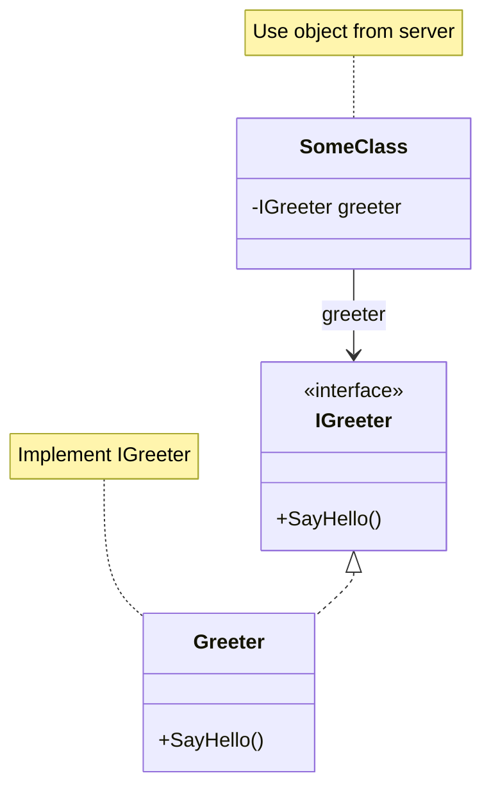

# PinionCore Remote
[](https://codeclimate.com/github/jiowchern/PinionCore.Remote/maintainability)
[](https://github.com/jiowchern/PinionCore.Remote/actions/workflows/dotnet-desktop.yml)
[](https://coveralls.io/github/jiowchern/PinionCore.Remote?branch=master)

[](https://deepwiki.com/jiowchern/PinionCore.Remote)  
[Ask OpenDeepWiki](https://opendeep.wiki/jiowchern/PinionCore.Remote/introduction?branch=master)


## 簡介

PinionCore Remote 是一個以 C# 開發的物件導向遠端通訊框架。
你可以用「介面」定義通訊協議，伺服器實作這些介面，客戶端像呼叫本地物件一樣呼叫，實際資料透過 TCP / WebSocket / 單機模擬等管道傳輸。

- 支援 .NET Standard 2.1（.NET 6/7/8、Unity 2021+）
- 支援 IL2CPP 與 AOT（需預先註冊序列化型別）
- 內建 TCP、WebSocket 與 Standalone 單機模式
- 透過 Source Generator 自動產生 `IProtocol` 實作，降低維護成本

## 核心特色

### 1. 介面導向通訊

只需要定義介面，不需要手寫序列化與協議解析：

```csharp
public interface IGreeter
{
    PinionCore.Remote.Value<HelloReply> SayHello(HelloRequest request);
}
```
伺服器實作介面：
```csharp
class Greeter : IGreeter
{
    PinionCore.Remote.Value<HelloReply> IGreeter.SayHello(HelloRequest request)
    {
        return new HelloReply { Message = $"Hello {request.Name}." };
    }
}
```
客戶端透過 QueryNotifier<IGreeter>() 拿到遠端代理，直接呼叫 SayHello，回傳 Value<T> 可以 await。

### 2. 可控的生命週期（Entry / Session / Soul）

伺服器入口實作 PinionCore.Remote.IEntry，在連線建立時收到 ISessionBinder，由你決定何時綁定/解除綁定介面：
```csharp
public class Entry : PinionCore.Remote.IEntry
{
    private readonly Greeter _greeter = new Greeter();

    void PinionCore.Remote.ISessionObserver.OnSessionOpened(PinionCore.Remote.ISessionBinder binder)
    {
        binder.Bind<IGreeter>(_greeter);
    }

    void PinionCore.Remote.ISessionObserver.OnSessionClosed(PinionCore.Remote.ISessionBinder binder)
    {
        // 客戶端斷線時要做的清理
    }

    void PinionCore.Remote.IEntry.Update()
    {
        // 每迴圈更新（可為空，視需求而定）
    }
}
```
Soul 負責管理所有連線與 Session：`new PinionCore.Remote.Server.Host(entry, protocol)`。

### 3. Value / Property / Notifier 支援

- Value<T>：非同步回傳值（PinionCore.Utility/Remote/Value.cs）
- Property<T>：狀態同步（PinionCore.Remote/Property.cs）
- Notifier<T>：物件供應/移除通知（PinionCore.Remote/Notifier.cs）

以 RPG 範例來看，可以這樣設計介面：
```csharp
public interface IActor
{
    PinionCore.Remote.Property<string> Name { get; }
    PinionCore.Remote.Property<int> Level { get; }
}
```
```csharp
public interface IPlayer : IActor
{
    PinionCore.Remote.Notifier<IActor> VisibleActors { get; } // 玩家看到的角色列表
    PinionCore.Remote.Property<int> Gold { get; }             // 金幣，只自己看得到
    PinionCore.Remote.Value<Path> Move(Position position);    // 移動命令
    event System.Action<Position> StopEvent;                  // 停止事件
}
```
客戶端操作起來就像本地物件，變更會透過框架同步。

### 4. 即時通知機制（Notifier）

Notifier<T> 讓伺服器只要操作一個集合，客戶端就能自動收到新增/移除通知：
```csharp
class GameServer : IGameServer
{
    private readonly PinionCore.Remote.Depot<IPlayer> _players = new PinionCore.Remote.Depot<IPlayer>();

    public PinionCore.Remote.Notifier<IPlayer> Players { get; }

    public GameServer()
    {
        Players = new PinionCore.Remote.Notifier<IPlayer>(_players);
    }

    void OnPlayerJoin(IPlayer player)
    {
        _players.Items.Add(player);    // 所有客戶端會收到 Supply
    }

    void OnPlayerLeave(IPlayer player)
    {
        _players.Items.Remove(player); // 所有客戶端會收到 Unsupply
    }
}
```
客戶端：
```csharp
agent.QueryNotifier<IPlayer>().Supply += player =>
{
    // 處理新玩家加入
};
```
### 5. 巢狀介面與複合結構

介面可以繼承與組合，讓協議定義對應 Domain Model：
```csharp
public interface IParty
{
    PinionCore.Remote.Notifier<IPlayer> Members { get; }
}

public interface IPartyService
{
    PinionCore.Remote.Value<IParty> CreateParty();
}
```
Source Generator 會自動處理巢狀介面與 Value<T> / Notifier<T> / Property<T> 等型別。

### 6. 響應式方法支援（Reactive）

PinionCore.Remote.Reactive 提供 Rx 擴充，用 IObservable<T> 串接遠端呼叫。

PinionCore.Remote.Reactive.Extensions 中重要的擴充方法：

- RemoteValue()：把 Value<T> 轉成 IObservable<T>
- SupplyEvent() / UnsupplyEvent()：把 Notifier 轉成 IObservable<T>

在整合測試 PinionCore.Integration.Tests/SampleTests.cs 中：
```csharp
// 重要：Rx 模式仍需要背景處理迴圈
var cts = new CancellationTokenSource();
var runTask = Task.Run(async () =>
{
    while (!cts.Token.IsCancellationRequested)
    {
        proxy.Agent.HandlePackets();
        proxy.Agent.HandleMessages();
        await Task.Delay(1, cts.Token);
    }
}, cts.Token);

// 建立 Rx 查詢鏈
var echoObs =
    from e in proxy.Agent
        .QueryNotifier<PinionCore.Remote.Tools.Protocol.Sources.TestCommon.Echoable>()
        .SupplyEvent()
    from val in e.Echo().RemoteValue()
    select val;

var echoValue = await echoObs.FirstAsync();

// 停止背景處理
cts.Cancel();
await runTask;
```
這個例子同時示範：

- **背景處理迴圈是必須的**：即使使用 Rx，仍需持續呼叫 HandlePackets/HandleMessages
- 透過 Notifier 的 SupplyEvent() 等待伺服器供應介面
- 呼叫遠端方法 Echo() 回傳 Value<int>
- 用 RemoteValue() 轉成 IObservable<int>，再用 Rx 取得一次結果

### 7. 多傳輸模式與 Standalone

內建三種傳輸方式：

- TCP：PinionCore.Remote.Server.Tcp.ListeningEndpoint / PinionCore.Remote.Client.Tcp.ConnectingEndpoint
- WebSocket：PinionCore.Remote.Server.Web.ListeningEndpoint / PinionCore.Remote.Client.Web.ConnectingEndpoint
- Standalone：PinionCore.Remote.Standalone.ListeningEndpoint（同時實作 Server 與 Client 端點，用於單機模擬）

整合測試 SampleTests 同時啟動三種端點並逐一驗證，確保各模式行為一致。

---
## 架構與模組總覽

主要專案：

- PinionCore.Remote：核心介面與抽象（IEntry、ISessionBinder、Value<T>、Property<T>、Notifier<T> 等）
- PinionCore.Remote.Client：Proxy、IConnectingEndpoint 及連線擴充（AgentExtensions.Connect）
- PinionCore.Remote.Server：Host、IListeningEndpoint、ServiceExtensions.ListenAsync
- PinionCore.Remote.Soul：伺服器 Session 管理、更新迴圈（ServiceUpdateLoop）
- PinionCore.Remote.Ghost：客戶端 Agent 實作（User），封包編碼與處理
- PinionCore.Remote.Standalone：ListeningEndpoint 以記憶體流模擬 Server/Client
- PinionCore.Network：IStreamable、TCP/WebSocket Peer、封包讀寫
- PinionCore.Serialization：預設序列化實作與型別描述
- PinionCore.Remote.Tools.Protocol.Sources：Source Generator，透過 [PinionCore.Remote.Protocol.Creator] 自動產生 IProtocol
- PinionCore.Remote.Gateway：閘道與多服務路由（詳細見該模組 README）

架構示意圖（概念一致，實際實作請以以下章節為準）：



---
## 快速開始（Hello World）

建議建立三個專案：Protocol、Server、Client。以下範例會對齊實際樣板 (PinionCore.Samples.HelloWorld.*) 的寫法。

### 環境需求

- .NET SDK 6 或以上
- Visual Studio 2022 / Rider / VS Code
- 若需 Unity，建議 Unity 2021 LTS 以上

### 1. Protocol 專案

建立 Class Library：

Sample/Protocol> dotnet new classlib

加入 NuGet 參考（版本請依實際發佈為準）：
```xml
<ItemGroup>
<PackageReference Include="PinionCore.Remote" Version="0.1.14.15" />
<PackageReference Include="PinionCore.Serialization" Version="0.1.14.12" />
<PackageReference Include="PinionCore.Remote.Tools.Protocol.Sources" Version="0.0.4.25">
    <PrivateAssets>all</PrivateAssets>
    <IncludeAssets>runtime; build; native; contentfiles; analyzers; buildtransitive</IncludeAssets>
</PackageReference>
</ItemGroup>
```
定義資料與介面：
```csharp
namespace Protocol
{
    public struct HelloRequest
    {
        public string Name;
    }

    public struct HelloReply
    {
        public string Message;
    }

    public interface IGreeter
    {
        PinionCore.Remote.Value<HelloReply> SayHello(HelloRequest request);
    }
}
```
建立 ProtocolCreator（Source Generator 入口）：
```csharp
namespace Protocol
{
    public static partial class ProtocolCreator
    {
        public static PinionCore.Remote.IProtocol Create()
        {
            PinionCore.Remote.IProtocol protocol = null;
            _Create(ref protocol);
            return protocol;
        }

        [PinionCore.Remote.Protocol.Creator]
        static partial void _Create(ref PinionCore.Remote.IProtocol protocol);
    }
}
```
 
> 注意：被標記為 [PinionCore.Remote.Protocol.Creator] 的方法必須是
> static partial void Method(ref PinionCore.Remote.IProtocol)，否則無法編譯。
 
### 2. Server 專案

建立 Console 專案：

```Sample/Server> dotnet new console```

csproj 參考：
```xml
<ItemGroup>
<PackageReference Include="PinionCore.Remote.Server" Version="0.1.14.13" />
<ProjectReference Include="..\Protocol\Protocol.csproj" />
</ItemGroup>
```
實作 IGreeter（對齊 PinionCore.Samples.HelloWorld.Server/Greeter.cs）：
```csharp
using Protocol;

namespace Server
{
    class Greeter : IGreeter
    {
        PinionCore.Remote.Value<HelloReply> IGreeter.SayHello(HelloRequest request)
        {
            return new HelloReply { Message = $"Hello {request.Name}." };
        }
    }
}
```
實作 Entry（對齊 HelloWorld 範例）：
```csharp
using PinionCore.Remote;
using Protocol;

namespace Server
{
    class Entry : IEntry
    {
        public volatile bool Enable = true;

        private readonly Greeter _greeter = new Greeter();

        void ISessionObserver.OnSessionOpened(ISessionBinder binder)
        {
            // 客戶端連線成功，綁定 IGreeter
            var soul = binder.Bind<IGreeter>(_greeter);
            // 若要解除綁定可呼叫 binder.Unbind(soul);
        }

        void ISessionObserver.OnSessionClosed(ISessionBinder binder)
        {
            // 客戶端斷線時要做的處理
            Enable = false;
        }

        void IEntry.Update()
        {
            // 若需要伺服器主迴圈更新，可放在這裡
        }
    }
}
```
啟動伺服器主程式（沿用 HelloWorld 實作方式）：
```csharp
using System;
using System.Threading.Tasks;
using PinionCore.Remote.Server;
using Protocol;

namespace Server
{
    internal class Program
    {
        static async Task Main(string[] args)
        {
            int port = int.Parse(args[0]);

            var protocol = ProtocolCreator.Create();
            var entry = new Entry();

            var host = new PinionCore.Remote.Server.Host(entry, protocol);
            PinionCore.Remote.Soul.IService service = host;

            var (disposeServer, errorInfos) = await service.ListenAsync(
                new PinionCore.Remote.Server.Tcp.ListeningEndpoint(port, 10));

            foreach (var error in errorInfos)
            {
                Console.WriteLine($"Listener error: {error.Exception}");
                return;
            }

            Console.WriteLine("Server started.");

            while (entry.Enable)
            {
                System.Threading.Thread.Sleep(0);
                // 若有需要，也可以在這裡手動呼叫 entry.Update()
            }

            disposeServer.Dispose();
            host.Dispose();

            Console.WriteLine("Press any key to exit.");
            Console.ReadKey();
        }
    }
}
```
### 3. Client 專案

建立 Console 專案：
```
Sample/Client> dotnet new console
```
csproj 參考：
```xml
<ItemGroup>
<PackageReference Include="PinionCore.Remote.Client" Version="0.1.14.12" />
<PackageReference Include="PinionCore.Remote.Reactive" Version="0.1.14.13" />
<ProjectReference Include="..\Protocol\Protocol.csproj" />
</ItemGroup>
```
客戶端程式（對齊 HelloWorld Client 實作）：
```csharp
using System;
using System.Net;
using System.Threading.Tasks;
using PinionCore.Remote.Client;
using Protocol;

namespace Client
{
    internal class Program
    {
        private static bool _enable = true;

        static void Main(string[] args)
        {
            _Run(args).Wait();
        }

        private static async Task _Run(string[] args)
        {
            var ip = IPAddress.Parse(args[0]);
            var port = int.Parse(args[1]);

            var protocol = ProtocolCreator.Create();
            var proxy = new Proxy(protocol);
            var agent = proxy.Agent;

            var endpoint = new PinionCore.Remote.Client.Tcp.ConnectingEndpoint(
                new IPEndPoint(ip, port));

            // Connect() 是 AgentExtensions 中的擴充方法
            // 它會自動呼叫 Enable(stream) 並返回 IDisposable 用於清理
            // 呼叫 Dispose() 時會自動執行 Disable() 和 endpoint.Dispose()
            var connection = await agent.Connect(endpoint).ConfigureAwait(false);

            agent.QueryNotifier<IGreeter>().Supply += greeter =>
            {
                var request = new HelloRequest { Name = "you" };
                greeter.SayHello(request).OnValue += _OnReply;
            };

            // 必須持續處理封包與訊息，否則遠端事件不會被觸發
            while (_enable)
            {
                System.Threading.Thread.Sleep(0);
                agent.HandleMessages();  // 處理遠端傳來的訊息
                agent.HandlePackets();   // 處理封包編碼
            }

            connection.Dispose();
            Console.WriteLine("Press any key to exit.");
            Console.ReadKey();
        }

        private static void _OnReply(HelloReply reply)
        {
            Console.WriteLine($"Receive message: {reply.Message}");
            _enable = false;
        }
    }
}
```

## 核心概念詳解

### IEntry / ISessionBinder / ISoul

- IEntry：伺服器入口，負責 Session 開/關與主迴圈更新。
- ISessionBinder：在 OnSessionOpened 傳入，用來 Bind<T> / Unbind(ISoul)。
- ISoul：代表一個已綁定到 Session 的實例，之後可用於解除綁定或查詢。

介面定義：

- PinionCore.Remote/IEntry.cs
- PinionCore.Remote/ISessionObserver.cs
- PinionCore.Remote/ISessionBinder.cs
- PinionCore.Remote/ISoul.cs

PinionCore.Remote.Soul.Service 會在內部使用 SessionEngine 管理所有 Session，PinionCore.Remote.Server.Host 則包裝它方便建立服務。

### Value<T>

Value<T> 主要特性：

- 支援 OnValue 事件與 await。
- 只會設定一次值（一次性結果）。
- 使用隱含轉型接出：return new HelloReply { ... }; 會自動包成 Value<HelloReply>。

實作位置：PinionCore.Utility/PinionCore.Utility/Remote/Value.cs

### Property<T>

Property<T> 是可通知的值型狀態：

- Value 屬性改變會觸發 DirtyEvent。
- 透過 PropertyObservable 可以轉成 IObservable<T>（PinionCore.Remote.Reactive/PropertyObservable.cs）。
- 提供隱含轉型成 T，用起來像普通屬性。

實作位置：PinionCore.Remote/Property.cs

### Notifier<T> 與 Depot<T>

Depot<T>（PinionCore.Utility/Remote/Depot.cs）是一個集合 + Notifier：

- Items.Add(item)：會觸發 Supply。
- Items.Remove(item)：會觸發 Unsupply。
- Notifier<T> 則包裝 Depot<TypeObject>，支援跨型別查詢與事件訂閱。

INotifierQueryable 介面（PinionCore.Remote/INotifierQueryable.cs）允許呼叫：

INotifier<T> QueryNotifier<T>();

Ghost.User 實作了 INotifierQueryable，所以客戶端可以透過 QueryNotifier<T> 取得任何介面的 Notifier。

### 串流方法（Streamable Method）

若介面方法定義如下：
```csharp
PinionCore.Remote.IAwaitableSource<int> StreamEcho(
    byte[] buffer,
    int offset,
    int count);
```
Source Generator 會將其視為「串流方法」：

- 傳送的資料只會包含 buffer[offset..offset+count)。
- 伺服器處理後的資料會原地寫回同一段區間。
- 回傳的 IAwaitableSource<int> 表示實際處理的位元組數（長度）。

內部檢查邏輯見 PinionCore.Remote.Tools.Protocol.Sources/MethodPinionCoreRemoteStreamable.cs。

---

## 傳輸模式與 Standalone

### TCP

伺服器端：
```csharp
var host = new PinionCore.Remote.Server.Host(entry, protocol);
PinionCore.Remote.Soul.IService service = host;
var (disposeServer, errorInfos) = await service.ListenAsync(
    new PinionCore.Remote.Server.Tcp.ListeningEndpoint(port, backlog: 10));
```
客戶端：
```csharp
var proxy = new PinionCore.Remote.Client.Proxy(protocol);
using var connection = await proxy.Connect(
    new PinionCore.Remote.Client.Tcp.ConnectingEndpoint(
        new System.Net.IPEndPoint(System.Net.IPAddress.Loopback, port)));
```
### WebSocket

伺服器端：
```csharp
var (disposeServer, errorInfos) = await service.ListenAsync(
    new PinionCore.Remote.Server.Web.ListeningEndpoint($"http://localhost:{webPort}/"));
```
客戶端：
```csharp
var proxy = new PinionCore.Remote.Client.Proxy(protocol);
using var connection = await proxy.Connect(
    new PinionCore.Remote.Client.Web.ConnectingEndpoint(
        $"ws://localhost:{webPort}/"));
```
PinionCore.Remote.Client.Web.ConnectingEndpoint 內部使用 System.Net.WebSockets.ClientWebSocket 與 PinionCore.Network.Web.Peer。

### Standalone（單機模擬）

PinionCore.Remote.Standalone.ListeningEndpoint 同時實作：

- PinionCore.Remote.Server.IListeningEndpoint
- PinionCore.Remote.Client.IConnectingEndpoint

用法（與 SampleTests 一致）：
```csharp
var protocol = ProtocolCreator.Create();
var entry = new Entry();
var host = new PinionCore.Remote.Server.Host(entry, protocol);
PinionCore.Remote.Soul.IService service = host;

var standaloneEndpoint = new PinionCore.Remote.Standalone.ListeningEndpoint();

var (disposeServer, errors) = await service.ListenAsync(standaloneEndpoint);

var proxy = new PinionCore.Remote.Client.Proxy(protocol);
using var connection = await proxy.Connect(standaloneEndpoint);

// 重要：必須持續處理封包與訊息
var running = true;
var processTask = Task.Run(async () =>
{
    while (running)
    {
        proxy.Agent.HandlePackets();
        proxy.Agent.HandleMessages();
        await Task.Delay(1);
    }
});

// 之後流程與一般 Client 相同
proxy.Agent.QueryNotifier<IGreeter>().Supply += async greeter =>
{
    var reply = await greeter.SayHello(new HelloRequest { Name = "offline" });
    Console.WriteLine(reply.Message);
    running = false;
};

await processTask;

// 清理資源
disposeServer.Dispose();
host.Dispose();

// ListeningEndpoint 會建立一對 Stream / ReverseStream，在同一個進程內模擬收送
```
---
## 進階主題

### Reactive 擴充（PinionCore.Remote.Reactive）

PinionCore.Remote.Reactive/Extensions.cs 提供以下常用擴充：

- ReturnVoid(this Action)：把 Action 包成 IObservable<Unit>
- RemoteValue(this Value<T>)：遠端回傳值轉 IObservable<T>
- PropertyChangeValue(this Property<T>)：屬性變更轉 IObservable<T>
- SupplyEvent/UnsupplyEvent(this INotifier<T>)：Notifier 事件轉 IObservable<T>

SampleTests 用 Rx 寫法串接：

1. 等待 Echo 介面供應：

    ```proxy.Agent.QueryNotifier<Echoable>().SupplyEvent()```
2. 呼叫遠端 Echo() 並用 RemoteValue() 取回：
```
    from e in ...
    from val in e.Echo().RemoteValue()
    select val;
```
這種寫法在需要組合多個連續遠端呼叫時非常適合。

### Gateway 模組

PinionCore.Remote.Gateway 提供：

- 多服務入口（Router）
- 群組化與負載平衡（LineAllocator）
- 版本共存（不同 IProtocol.VersionCode）
- 與 Chat1 範例整合的 Gateway 主控流程

詳細請參考 PinionCore.Remote.Gateway/README.md 以及 PinionCore.Consoles.Chat1.* 專案。

### 自訂連線（Custom Connection）

若內建 TCP/WebSocket 不符合需求，可自行實作：

- PinionCore.Network.IStreamable（收送 byte[]）
- PinionCore.Remote.Client.IConnectingEndpoint
- PinionCore.Remote.Server.IListeningEndpoint

用法與內建端點相同，只是底層換成你的協議或傳輸。

### 自訂序列化

若需要自訂序列化，應直接使用底層類別而非簡化包裝：

**伺服器端（使用 PinionCore.Remote.Soul.Service）**：
```csharp
var serializer = new YourSerializer();
var internalSerializer = new YourInternalSerializer();
var pool = PinionCore.Memorys.PoolProvider.Shared;

// 注意：這裡使用 Soul.Service（底層完整類別），不是 Server.Host（簡化包裝）
var service = new PinionCore.Remote.Soul.Service(entry, protocol, serializer, internalSerializer, pool);
```

**客戶端（使用 PinionCore.Remote.Ghost.Agent）**：
```csharp
var serializer = new YourSerializer();
var internalSerializer = new YourInternalSerializer();
var pool = PinionCore.Memorys.PoolProvider.Shared;

// 注意：這裡使用 Ghost.Agent（底層完整類別），不是 Client.Proxy（簡化包裝）
var agent = new PinionCore.Remote.Ghost.Agent(protocol, serializer, internalSerializer, pool);
```

**簡化包裝與完整類別的對應關係**：
- `Server.Host` 內部使用預設序列化的 `Soul.Service`
- `Client.Proxy` 內部使用預設序列化的 `Ghost.Agent`

需要序列化的型別可由 IProtocol.SerializeTypes 取得，或參考 PinionCore.Serialization/README.md。

---
## 範例與測試

建議從以下專案開始閱讀：

- PinionCore.Samples.Helloworld.Protocols：基本 Protocol 與 ProtocolCreator 實作
- PinionCore.Samples.Helloworld.Server：Entry、Greeter、Host 用法
- PinionCore.Samples.Helloworld.Client：Proxy、ConnectingEndpoint 與 QueryNotifier
- **PinionCore.Integration.Tests/SampleTests.cs**（重點推薦）：
    - **同時啟動 TCP / WebSocket / Standalone 三種端點並行測試**
    - 展示如何使用 Rx (SupplyEvent / RemoteValue) 處理遠端呼叫
    - **詳細的英文註解說明每個步驟**，包括為何需要背景處理迴圈
    - 驗證三種傳輸模式行為一致
- PinionCore.Remote.Gateway + PinionCore.Consoles.Chat1.*：Gateway 實際落地案例

---

## 建置、測試與打包

在專案根目錄：
```
dotnet restore
dotnet build --configuration Release --no-restore
```
# 執行所有測試並產出覆蓋率
```
dotnet test /p:CollectCoverage=true \
            /p:CoverletOutput=../CoverageResults/ \
            /p:MergeWith="../CoverageResults/coverage.json" \
            /p:CoverletOutputFormat="lcov%2cjson" -m:1
```
# 打包 NuGet
```
dotnet pack --configuration Release --output ./nupkgs
```
單一測試專案可以使用：
```
dotnet test PinionCore.Integration.Tests/PinionCore.Integration.Tests.csproj
```
## 結語

PinionCore Remote 的目標，是用「介面導向」的方式，把伺服器與客戶端之間的溝通，從繁瑣的封包格式與序列化細節中抽離出來。你只需要專注在 Domain 模型與狀態管理上，其餘連線、序列化、供應/退供與版本檢查等細節，都交
給框架處理。無論是遊戲、即時服務、工具後端，或是透過 Gateway 串起多個服務，只要你的需求是「在不同進程或機器之間像呼叫本地介面一樣互動」，這個框架都可以成為你的基礎。

如果你第一次接觸這個專案，建議從 PinionCore.Samples.HelloWorld.* 開始，照著「快速開始」章節建立 Protocol / Server / Client 三個專案，實際跑一次完整流程。接著再閱讀 PinionCore.Integration.Tests（特別是
SampleTests）與 Gateway 相關範例，會更清楚整體架構如何在真實場景下組合運作。當你需要更進階的能力，例如自訂傳輸層或序列化格式，可以回頭參考「進階主題」章節與對應程式碼檔案。

在使用過程中，如果你發現文件哪裡不清楚、範例有不足之處，或遇到實際需求無法覆蓋的情境，非常歡迎在 GitHub 開 Issue 討論，也歡迎提出 PR。無論是補充說明、修正文案、增加小型範例或整合測試，只要能讓下一個使用者更
容易上手，都是非常有價值的貢獻。希望 PinionCore Remote 能在你的專案裡，替你省下處理網路細節的時間，讓你把心力放在真正重要的遊戲與應用程式設計上。
