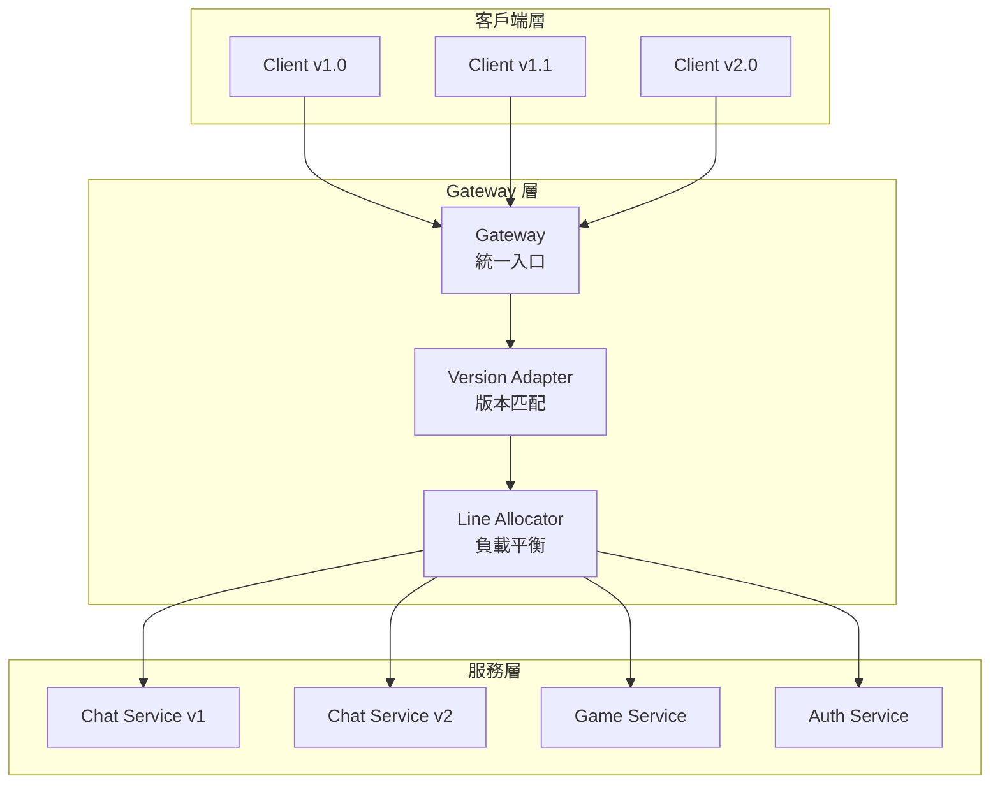

# PinionCore Remote
[](https://codeclimate.com/github/jiowchern/PinionCore.Remote/maintainability)
[](https://github.com/jiowchern/PinionCore.Remote/actions/workflows/dotnet-desktop.yml)
[](https://coveralls.io/github/jiowchern/PinionCore.Remote?branch=master)

[](https://deepwiki.com/jiowchern/PinionCore.Remote)  
[Ask OpenDeepWiki](https://opendeep.wiki/jiowchern/PinionCore.Remote/introduction?branch=master)

---

## 目錄

- [簡介](#簡介)
- [核心特色](#核心特色)
  - [介面導向通訊](#1-介面導向通訊)
  - [可控的生命週期（Entry / Session / Soul）](#2-可控的生命週期entry--session--soul)
  - [Value / Property / Notifier](#3-value--property--notifier-支援)
  - [Reactive 支援](#4-響應式方法支援reactive)
  - [公開與私有介面](#5-簡易的公開與私有介面支援)
  - [多傳輸模式與 Standalone](#6-多傳輸模式與-standalone)
  - [Gateway 閘道服務](#7-gateway-閘道服務)
- [架構與模組總覽](#架構與模組總覽)
- [快速開始（Hello World）](#快速開始hello-world)
  - [環境需求](#環境需求)
  - [1 協議專案 Protocol](#1-protocol-專案)
  - [2 伺服器專案 Server](#2-server-專案)
  - [3 客戶端專案 Client](#3-client-專案)
- [核心概念詳解](#核心概念詳解)
  - [IEntry / ISessionBinder / ISoul](#ientry--isessionbinder--isoul)
  - [Value\<T>](#valuet)
  - [Property\<T>](#propertyt)
  - [Notifier\<T> 與 Depot\<T>](#notifiert-與-depott)
  - [串流方法（Streamable Method）](#串流方法streamable-method)
- [傳輸模式與 Standalone](#傳輸模式與-standalone)
  - [TCP](#tcp)
  - [WebSocket](#websocket)
  - [Standalone（單機模擬）](#standalone單機模擬)
- [進階主題](#進階主題)
  - [Reactive 擴充](#reactive-擴充pinioncoreremotereactive)
  - [Gateway 模組](#gateway-模組)
  - [自訂連線（Custom Connection）](#自訂連線custom-connection)
  - [自訂序列化](#自訂序列化)
- [範例與測試](#範例與測試)
- [結語](#結語)

---

## 簡介

**PinionCore Remote** 是一個以 C# 開發的「介面導向」遠端通訊框架。

你可以用 **介面（interface）** 定義遠端協議，伺服器實作這些介面，客戶端則像呼叫本地物件一樣呼叫它們；實際資料會透過 **TCP / WebSocket / Standalone（單機模擬）** 傳輸。

- 支援 **.NET Standard 2.1**（.NET 6/7/8、Unity 2021+）
- 支援 **IL2CPP 與 AOT**（需預先註冊序列化型別）
- 內建 **TCP、WebSocket、Standalone** 三種傳輸模式
- 透過 **Source Generator** 自動產生 `IProtocol` 實作，降低維護成本
- 以 **Value / Property / Notifier** 為核心抽象描述遠端行為與狀態
- 搭配 **PinionCore.Remote.Reactive** 可用 Rx 方式寫遠端流程

---

## 線上文件

- [DeepWiki](https://deepwiki.com/jiowchern/PinionCore.Remote)
- [OpenDeepWiki](https://opendeep.wiki/jiowchern/PinionCore.Remote/introduction?branch=master)

---

## 核心特色

### 1. 介面導向通訊

你只需要定義介面，不需要手寫序列化或協議解析：

```csharp
public interface IGreeter
{
    PinionCore.Remote.Value<HelloReply> SayHello(HelloRequest request);
}
```

伺服器實作這個介面：

```csharp
class Greeter : IGreeter
{
    PinionCore.Remote.Value<HelloReply> IGreeter.SayHello(HelloRequest request)
    {
        return new HelloReply { Message = $"Hello {request.Name}." };
    }
}
```

客戶端透過 `QueryNotifier<IGreeter>()` 拿到遠端代理，像本地物件一樣呼叫：

```csharp
agent.QueryNotifier<IGreeter>().Supply += greeter =>
{
    var request = new HelloRequest { Name = "you" };
    greeter.SayHello(request).OnValue += reply =>
    {
        Console.WriteLine($"Receive message: {reply.Message}");
    };
};
```

- `Value<T>` 可以 `await`，也可以透過 `OnValue` 事件取得結果。
- 你不需要處理任何連線 ID 或 RPC ID，只要跟著介面走即可。

---

### 2. 可控的生命週期（Entry / Session / Soul）

伺服器入口實作 `PinionCore.Remote.IEntry`，在連線建立/關閉時由框架呼叫：

```csharp
public class Entry : PinionCore.Remote.IEntry
{
    private readonly Greeter _greeter = new Greeter();

    void PinionCore.Remote.ISessionObserver.OnSessionOpened(PinionCore.Remote.ISessionBinder binder)
    {
        // 客戶端連線成功，綁定 _greeter
        var soul = binder.Bind<IGreeter>(_greeter);

        // 若要解除綁定可以呼叫：
        // binder.Unbind(soul);
    }

    void PinionCore.Remote.ISessionObserver.OnSessionClosed(PinionCore.Remote.ISessionBinder binder)
    {
        // 客戶端斷線時要做的清理        
    }

    void PinionCore.Remote.IEntry.Update()
    {
        // 每迴圈更新（可為空，視需求而定）
    }
}
```

建立伺服器時使用 `Host`：

```csharp
var host = new PinionCore.Remote.Server.Host(entry, protocol);
// Host 內部使用 SessionEngine 管理所有 Session
```

`Entry / Session / Soul` 組合出一套可控制的遠端物件生命週期模型。

---

### 3. Value / Property / Notifier 支援

PinionCore Remote 以「介面」為中心，提供三種常用成員型別來描述遠端行為與狀態：

#### Value\<T>：一次性非同步呼叫

- 類似 `Task<T>` 的概念。
- 用於請求 / 回應流程，例如登入、取得設定、送出指令。
- 只會被設定一次；支援 `await` 與 `OnValue` 事件。

```csharp
Value<LoginResult> Login(LoginRequest request);
```

#### Property\<T>：穩定存在的遠端狀態

- 伺服器實作端維護實際值。
- 客戶端透過代理讀取，並可在變更時收到通知（DirtyEvent / Observable）。
- 適合如：玩家名稱、房間標題、伺服器版本等。

```csharp
Property<string> Nickname { get; }
Property<string> RoomName { get; }
```

#### Notifier\<T>：動態集合與巢狀物件樹

`INotifier<T>` 描述「一組動態存在的遠端物件」，`T` 本身可以是介面，因此很適合描述 Lobby / Room / Player 等巢狀結構：

```csharp
public interface IChatEntry
{
    INotifier<IRoom> Rooms { get; }
}

public interface IRoom
{
    Property<string> Name { get; }
    INotifier<IPlayer> Players { get; }
}

public interface IPlayer
{
    Property<string> Nickname { get; }
}
```

伺服器：

- 房間建立 → `Rooms.Supply(roomImpl)`
- 房間刪除 → `Rooms.Unsupply(roomImpl)`
- 玩家進入 → `room.Players.Supply(playerImpl)`
- 玩家離開 → `room.Players.Unsupply(playerImpl)`

客戶端：

```csharp
agent.QueryNotifier<IRoom>().Supply += room =>
{
    // room 已是遠端代理
    room.Players.Supply += player =>
    {
        Console.WriteLine($"Player joined: {player.Nickname.Value}");
    };
};
```

**重點：**

- Notifier 不只是事件集合，而是「會增減的物件集合」＋「巢狀物件樹」的同步工具。
- 客戶端不需要管理任何 ID 或查表，只要依照介面層級操作即可。

---

### 4. 響應式方法支援（Reactive）

`PinionCore.Remote.Reactive` 提供 Rx 擴充，讓你用 `IObservable<T>` 串接遠端流程。

重要擴充方法（在 `PinionCore.Remote.Reactive.Extensions` 中）：

- `RemoteValue()`：`Value<T> → IObservable<T>`
- `SupplyEvent()` / `UnsupplyEvent()`：`INotifier<T> → IObservable<T>`

整合測試 `PinionCore.Integration.Tests/SampleTests.cs` 中的範例（節錄）：

```csharp
var cts = new CancellationTokenSource();
var runTask = Task.Run(async () =>
{
    while (!cts.Token.IsCancellationRequested)
    {
        proxy.Agent.HandlePackets();
        proxy.Agent.HandleMessages();
        await Task.Delay(1, cts.Token);
    }
}, cts.Token);

var echoObs =
    from e in proxy.Agent
        .QueryNotifier<Echoable>()
        .SupplyEvent()
    from val in e.Echo().RemoteValue()
    select val;

var echoValue = await echoObs.FirstAsync();

cts.Cancel();
await runTask;
```

注意：

- 即使用 Rx，**背景處理迴圈仍然必須存在**（持續呼叫 `HandlePackets` / `HandleMessages`）。
- Rx 只是讓流程組裝更方便，並不取代底層事件處理。

---

### 5. 簡易的公開與私有介面支援

由於 PinionCore Remote 採用介面導向，伺服器可以針對不同客戶端綁定不同介面，輕鬆實現「公開 / 私有」 API：

```csharp
public interface IPublicService
{
    Value<string> GetPublicData();
}

public interface IPrivateService : IPublicService
{
    Value<string> GetPrivateData();
}

class ServiceImpl : IPrivateService
{
    public Value<string> GetPublicData() => "This is public data.";
    public Value<string> GetPrivateData() => "This is private data.";
}
```

伺服器端：

```csharp
void ISessionObserver.OnSessionOpened(ISessionBinder binder)
{
    var serviceImpl = new ServiceImpl();

    if (IsAuthenticatedClient(binder))
    {
        binder.Bind<IPrivateService>(serviceImpl); // 已驗證客戶端
    }

    binder.Bind<IPublicService>(serviceImpl);      // 所有人都有
}
```

未驗證客戶端只能存取 `IPublicService`，已驗證客戶端則可以用 `IPrivateService`。

---

### 6. 多傳輸模式與 Standalone

內建三種傳輸方式：

- **TCP**  
  - `PinionCore.Remote.Server.Tcp.ListeningEndpoint`  
  - `PinionCore.Remote.Client.Tcp.ConnectingEndpoint`
- **WebSocket**  
  - `PinionCore.Remote.Server.Web.ListeningEndpoint`  
  - `PinionCore.Remote.Client.Web.ConnectingEndpoint`
- **Standalone（單機模擬）**  
  - `PinionCore.Remote.Standalone.ListeningEndpoint`  
  - 同時實作 Server / Client 端點，適合同進程模擬與測試

整合測試 `SampleTests` 同時啟動三種端點並逐一驗證，確保行為一致。

---

### 7. Gateway 閘道服務

**模組目的**：

`PinionCore.Remote.Gateway` 提供企業級的服務閘道功能，作為多個後端服務的統一入口，解決以下場景：

- **多服務路由**：統一入口分發請求到不同的後端服務（Chat、Game、Auth 等）
- **版本共存**：同時支援多個協議版本（`IProtocol.VersionCode`），實現平滑升級
- **負載平衡**：`LineAllocator` 提供服務實例的分配與平衡
- **服務隔離**：不同服務獨立部署、獨立擴展，透過 Gateway 統一管理

**架構示意**：



**核心組件**：

- **Router**：根據協議版本、服務類型進行路由分發
- **LineAllocator**：管理服務實例群組，實現負載平衡與容錯
- **Version Adapter**：處理不同協議版本的客戶端共存，協議升級無需停機

**使用場景**：

- 需要同時運行多個獨立服務（微服務架構）
- 需要協議版本管理與平滑升級
- 需要橫向擴展與負載平衡
- 需要統一的連線管理與監控入口

詳細說明與範例請參考 `PinionCore.Remote.Gateway/README.md` 與 `PinionCore.Consoles.Chat1.*` 專案。

---

## 架構與模組總覽

主要專案與角色：

- **PinionCore.Remote**  
  - 核心介面與抽象：`IEntry`、`ISessionBinder`、`ISoul`  
  - 狀態型別：`Value<T>`、`Property<T>`、`Notifier<T>`
- **PinionCore.Remote.Client**  
  - `Proxy`、`IConnectingEndpoint`  
  - 連線擴充：`AgentExtensions.Connect`
- **PinionCore.Remote.Server**  
  - `Host`、`IListeningEndpoint`  
  - 建立服務與監聽：`ServiceExtensions.ListenAsync`
- **PinionCore.Remote.Soul**  
  - 伺服器 Session 管理（`SessionEngine`）  
  - 更新迴圈：`ServiceUpdateLoop`
- **PinionCore.Remote.Ghost**  
  - 客戶端 `Agent` 實作（`User`）  
  - 封包編碼與處理
- **PinionCore.Remote.Standalone**  
  - `ListeningEndpoint` 使用記憶體流模擬 Server/Client
- **PinionCore.Network**  
  - `IStreamable` 介面、TCP/WebSocket Peer、封包讀寫
- **PinionCore.Serialization**  
  - 預設序列化實作與型別描述（可替換）
- **PinionCore.Remote.Tools.Protocol.Sources**  
  - Source Generator  
  - 透過 `[PinionCore.Remote.Protocol.Creator]` 自動產生 `IProtocol`
- **PinionCore.Remote.Gateway**  
  - Gateway / Router、多服務路由與版本共存（詳見該模組 README）

---

## 快速開始（Hello World）

建議建立三個專案：**Protocol、Server、Client**。  
以下範例是簡化版流程，實際完整範例可參考 repo 中：

- `PinionCore.Samples.HelloWorld.Protocols`
- `PinionCore.Samples.HelloWorld.Server`
- `PinionCore.Samples.HelloWorld.Client`

### 環境需求

- .NET SDK 6 或以上
- Visual Studio 2022 / Rider / VS Code
- 若需 Unity，建議 Unity 2021 LTS 以上

---

### 1. Protocol 專案

建立 Class Library：

```bash
Sample/Protocol> dotnet new classlib
```

加入 NuGet 參考（版本請依實際發佈為準）：

```xml
<ItemGroup>
  <PackageReference Include="PinionCore.Remote" Version="0.1.14.15" />
  <PackageReference Include="PinionCore.Serialization" Version="0.1.14.12" />
  <PackageReference Include="PinionCore.Remote.Tools.Protocol.Sources" Version="0.0.4.25">
    <PrivateAssets>all</PrivateAssets>
    <IncludeAssets>runtime; build; native; contentfiles; analyzers; buildtransitive</IncludeAssets>
  </PackageReference>
</ItemGroup>
```

定義資料與介面（以簡化 HelloWorld 為例）：

```csharp
namespace Protocol
{
    public struct HelloRequest
    {
        public string Name;
    }

    public struct HelloReply
    {
        public string Message;
    }

    public interface IGreeter
    {
        PinionCore.Remote.Value<HelloReply> SayHello(HelloRequest request);
    }
}
```

建立 `ProtocolCreator`（Source Generator 入口）：

```csharp
namespace Protocol
{
    public static partial class ProtocolCreator
    {
        public static PinionCore.Remote.IProtocol Create()
        {
            PinionCore.Remote.IProtocol protocol = null;
            _Create(ref protocol);
            return protocol;
        }

        [PinionCore.Remote.Protocol.Creator]
        static partial void _Create(ref PinionCore.Remote.IProtocol protocol);
    }
}
```

> 注意：被標記為 `[PinionCore.Remote.Protocol.Creator]` 的方法簽章必須是  
> `static partial void Method(ref PinionCore.Remote.IProtocol)`，否則無法編譯。

---

### 2. Server 專案

建立 Console 專案：

```bash
Sample/Server> dotnet new console
```

`csproj` 參考：

```xml
<ItemGroup>
  <PackageReference Include="PinionCore.Remote.Server" Version="0.1.14.13" />
  <ProjectReference Include="..\Protocol\Protocol.csproj" />
</ItemGroup>
```

實作 `IGreeter`：

```csharp
using Protocol;

namespace Server
{
    class Greeter : IGreeter
    {
        PinionCore.Remote.Value<HelloReply> IGreeter.SayHello(HelloRequest request)
        {
            return new HelloReply { Message = $"Hello {request.Name}." };
        }
    }
}
```

實作 `Entry`：

```csharp
using PinionCore.Remote;
using Protocol;

namespace Server
{
    class Entry : IEntry
    {
        public volatile bool Enable = true;
        private readonly Greeter _greeter = new Greeter();

        void ISessionObserver.OnSessionOpened(ISessionBinder binder)
        {
            // 客戶端連線成功，綁定 IGreeter
            var soul = binder.Bind<IGreeter>(_greeter);
        }

        void ISessionObserver.OnSessionClosed(ISessionBinder binder)
        {
            // 客戶端斷線時要做的處理
            Enable = false;
        }

        void IEntry.Update()
        {
            // 伺服器主迴圈更新（如有需要）
        }
    }
}
```

啟動伺服器主程式（TCP 版本）：

```csharp
using System;
using System.Threading.Tasks;
using PinionCore.Remote.Server;
using Protocol;

namespace Server
{
    internal class Program
    {
        static async Task Main(string[] args)
        {
            int port = int.Parse(args[0]);

            var protocol = ProtocolCreator.Create();
            var entry = new Entry();

            var host = new PinionCore.Remote.Server.Host(entry, protocol);
            PinionCore.Remote.Soul.IService service = host;

            var (disposeServer, errorInfos) = await service.ListenAsync(
                new PinionCore.Remote.Server.Tcp.ListeningEndpoint(port, backlog: 10));

            foreach (var error in errorInfos)
            {
                Console.WriteLine($"Listener error: {error.Exception}");
                return;
            }

            Console.WriteLine("Server started.");

            while (entry.Enable)
            {
                System.Threading.Thread.Sleep(0);
                // 如有需要，也可以呼叫 entry.Update();
            }

            disposeServer.Dispose();
            host.Dispose();

            Console.WriteLine("Press any key to exit.");
            Console.ReadKey();
        }
    }
}
```

---

### 3. Client 專案

建立 Console 專案：

```bash
Sample/Client> dotnet new console
```

`csproj` 參考：

```xml
<ItemGroup>
  <PackageReference Include="PinionCore.Remote.Client" Version="0.1.14.12" />
  <PackageReference Include="PinionCore.Remote.Reactive" Version="0.1.14.13" />
  <ProjectReference Include="..\Protocol\Protocol.csproj" />
</ItemGroup>
```

客戶端程式（簡化版）：

```csharp
using System;
using System.Net;
using System.Threading.Tasks;
using PinionCore.Remote.Client;
using Protocol;

namespace Client
{
    internal class Program
    {
        private static bool _enable = true;

        static void Main(string[] args)
        {
            _Run(args).Wait();
        }

        private static async Task _Run(string[] args)
        {
            var ip = IPAddress.Parse(args[0]);
            var port = int.Parse(args[1]);

            var protocol = ProtocolCreator.Create();
            var proxy = new Proxy(protocol);
            var agent = proxy.Agent;

            var endpoint = new PinionCore.Remote.Client.Tcp.ConnectingEndpoint(
                new IPEndPoint(ip, port));

            // Connect() 是 AgentExtensions 中的擴充方法
            var connection = await agent.Connect(endpoint).ConfigureAwait(false);

            agent.QueryNotifier<IGreeter>().Supply += greeter =>
            {
                var request = new HelloRequest { Name = "you" };
                greeter.SayHello(request).OnValue += _OnReply;
            };

            // 必須持續處理封包與訊息
            while (_enable)
            {
                System.Threading.Thread.Sleep(0);
                agent.HandleMessages();
                agent.HandlePackets();
            }

            connection.Dispose();
            Console.WriteLine("Press any key to exit.");
            Console.ReadKey();
        }

        private static void _OnReply(HelloReply reply)
        {
            Console.WriteLine($"Receive message: {reply.Message}");
            _enable = false;
        }
    }
}
```

---

## 核心概念詳解

### IEntry / ISessionBinder / ISoul

- **`IEntry`**：伺服器入口，負責 Session 開/關與更新。
- **`ISessionBinder`**：在 `OnSessionOpened` 傳入，用來 `Bind<T>` / `Unbind(ISoul)`。
- **`ISoul`**：代表一個已綁定到 Session 的實例，可用於之後解除綁定或查詢。

相關檔案：

- `PinionCore.Remote/IEntry.cs`
- `PinionCore.Remote/ISessionObserver.cs`
- `PinionCore.Remote/ISessionBinder.cs`
- `PinionCore.Remote/ISoul.cs`

`PinionCore.Remote.Soul.Service` 使用 `SessionEngine` 管理所有 Session，  
`PinionCore.Remote.Server.Host` 則包裝它以便建立服務。

---

### Value\<T>

特性：

- 支援 `OnValue` 事件與 `await`。
- 只會設定一次值（一次性結果）。
- 支援隱含轉型：`return new HelloReply { ... };` 會自動包成 `Value<HelloReply>`。

實作位置：`PinionCore.Utility/Remote/Value.cs`

---

### Property\<T>

可通知的狀態值：

- 設定 `Value` 時會觸發 DirtyEvent。
- 可透過 `PropertyObservable` 轉成 `IObservable<T>`（在 `PinionCore.Remote.Reactive/PropertyObservable.cs`）。
- 提供隱含轉型成 `T`，使用起來像一般屬性。

實作位置：`PinionCore.Remote/Property.cs`

---

### Notifier\<T> 與 Depot\<T>

`Depot<T>`（`PinionCore.Utility/Remote/Depot.cs`）是集合＋通知結合：

- `Items.Add(item)` → 觸發 `Supply`
- `Items.Remove(item)` → 觸發 `Unsupply`

`Notifier<T>` 包裝 `Depot<TypeObject>`，支援跨型別查詢與事件訂閱。

`INotifierQueryable` 介面（`PinionCore.Remote/INotifierQueryable.cs`）可呼叫：

```csharp
INotifier<T> QueryNotifier<T>();
```

`Ghost.User` 實作了 `INotifierQueryable`，  
所以客戶端可以透過 `QueryNotifier<T>` 取得任何介面的 Notifier。

---

### 串流方法（Streamable Method）

若介面方法定義如下：

```csharp
PinionCore.Remote.IAwaitableSource<int> StreamEcho(
    byte[] buffer,
    int offset,
    int count);
```

Source Generator 會將其視為「串流方法」：

- 傳送資料只包含 `buffer[offset..offset+count)`。
- 伺服器處理後的資料會原地寫回同一段區間。
- 回傳的 `IAwaitableSource<int>` 表示實際處理的位元組數。

檢查邏輯見：  
`PinionCore.Remote.Tools.Protocol.Sources/MethodPinionCoreRemoteStreamable.cs`

---

## 傳輸模式與 Standalone

### TCP

伺服器端：

```csharp
var host = new PinionCore.Remote.Server.Host(entry, protocol);
PinionCore.Remote.Soul.IService service = host;

var (disposeServer, errorInfos) = await service.ListenAsync(
    new PinionCore.Remote.Server.Tcp.ListeningEndpoint(port, backlog: 10));
```

客戶端：

```csharp
var proxy = new PinionCore.Remote.Client.Proxy(protocol);
using var connection = await proxy.Connect(
    new PinionCore.Remote.Client.Tcp.ConnectingEndpoint(
        new System.Net.IPEndPoint(System.Net.IPAddress.Loopback, port)));
```

---

### WebSocket

伺服器端：

```csharp
var (disposeServer, errorInfos) = await service.ListenAsync(
    new PinionCore.Remote.Server.Web.ListeningEndpoint($"http://localhost:{webPort}/"));
```

客戶端：

```csharp
var proxy = new PinionCore.Remote.Client.Proxy(protocol);
using var connection = await proxy.Connect(
    new PinionCore.Remote.Client.Web.ConnectingEndpoint(
        $"ws://localhost:{webPort}/"));
```

---

### Standalone（單機模擬）

`PinionCore.Remote.Standalone.ListeningEndpoint` 同時實作：

- `PinionCore.Remote.Server.IListeningEndpoint`
- `PinionCore.Remote.Client.IConnectingEndpoint`

用法（簡化自 `SampleTests`）：

```csharp
var protocol = ProtocolCreator.Create();
var entry = new Entry();
var host = new PinionCore.Remote.Server.Host(entry, protocol);
PinionCore.Remote.Soul.IService service = host;

var standaloneEndpoint = new PinionCore.Remote.Standalone.ListeningEndpoint();

var (disposeServer, errors) = await service.ListenAsync(standaloneEndpoint);

var proxy = new PinionCore.Remote.Client.Proxy(protocol);
using var connection = await proxy.Connect(standaloneEndpoint);

// 重要：必須持續處理封包與訊息
var running = true;
var processTask = Task.Run(async () =>
{
    while (running)
    {
        proxy.Agent.HandlePackets();
        proxy.Agent.HandleMessages();
        await Task.Delay(1);
    }
});

proxy.Agent.QueryNotifier<IGreeter>().Supply += async greeter =>
{
    var reply = await greeter.SayHello(new HelloRequest { Name = "offline" });
    Console.WriteLine(reply.Message);
    running = false;
};

await processTask;

disposeServer.Dispose();
host.Dispose();
```

---

## 進階主題

### Reactive 擴充（PinionCore.Remote.Reactive）

`PinionCore.Remote.Reactive/Extensions.cs` 提供常用擴充：

- `ReturnVoid(this Action)`：`Action → IObservable<Unit>`
- `RemoteValue(this Value<T>)`：遠端回傳值轉 `IObservable<T>`
- `PropertyChangeValue(this Property<T>)`：屬性變更轉 `IObservable<T>`
- `SupplyEvent/UnsupplyEvent(this INotifier<T>)`：Notifier 事件轉 `IObservable<T>`

搭配 LINQ-to-Rx，可以很自然地組成遠端流程。

---

### Gateway 模組

`PinionCore.Remote.Gateway` 提供：

- 多服務入口（Router）
- 群組化與負載平衡（LineAllocator）
- 版本共存（不同 `IProtocol.VersionCode`）
- 與 `PinionCore.Consoles.Chat1.*` 整合的 Gateway 案例

詳細可參考 `PinionCore.Remote.Gateway/README.md` 與 Chat 範例程式。

---

### 自訂連線（Custom Connection）

若內建 TCP / WebSocket 不符合需求，可以自訂：

- `PinionCore.Network.IStreamable`（收送 byte[]）
- `PinionCore.Remote.Client.IConnectingEndpoint`
- `PinionCore.Remote.Server.IListeningEndpoint`

用法與內建端點相同，只是底層換成你自己的協議或傳輸。

---

### 自訂序列化

需要自訂序列化時，建議直接使用底層類別（而不是簡化包裝）：

伺服器端（使用 `Soul.Service`）：

```csharp
var serializer = new YourSerializer();
var internalSerializer = new YourInternalSerializer();
var pool = PinionCore.Memorys.PoolProvider.Shared;

var service = new PinionCore.Remote.Soul.Service(
    entry, protocol, serializer, internalSerializer, pool);
```

客戶端（使用 `Ghost.Agent`）：

```csharp
var serializer = new YourSerializer();
var internalSerializer = new YourInternalSerializer();
var pool = PinionCore.Memorys.PoolProvider.Shared;

var agent = new PinionCore.Remote.Ghost.Agent(
    protocol, serializer, internalSerializer, pool);
```

對應關係：

- `Server.Host`：封裝預設序列化的 `Soul.Service`
- `Client.Proxy`：封裝預設序列化的 `Ghost.Agent`

需要序列化的型別可由 `IProtocol.SerializeTypes` 取得，  
或參考 `PinionCore.Serialization/README.md`。

---

## 範例與測試

建議閱讀順序：

1. **PinionCore.Samples.HelloWorld.Protocols**  
   - 基本 Protocol 與 `ProtocolCreator` 實作
2. **PinionCore.Samples.HelloWorld.Server**  
   - `Entry`、`Greeter`、`Host` 用法
3. **PinionCore.Samples.HelloWorld.Client**  
   - `Proxy`、`ConnectingEndpoint` 與 `QueryNotifier`
4. **PinionCore.Integration.Tests/SampleTests.cs**（強烈推薦）  
   - 同時啟動 TCP / WebSocket / Standalone 三種端點  
   - 使用 Rx (`SupplyEvent` / `RemoteValue`) 處理遠端呼叫  
   - 詳細英文註解解釋背景處理迴圈的必要性  
   - 驗證多種傳輸模式行為一致
5. **PinionCore.Remote.Gateway + PinionCore.Consoles.Chat1.***  
   - Gateway 在實際專案中的組合與運作方式

---

## 結語

PinionCore Remote 的設計目標，是用「介面導向」把伺服器與客戶端之間的溝通，從繁瑣的封包格式、序列化與 ID 管理中抽離出來。你可以專注在 Domain 模型與狀態管理，其餘連線、供應 / 退供、版本檢查等細節交給框架處理。

無論是遊戲、即時服務、工具後端，或是透過 Gateway 串起多個服務，只要你的需求是「在不同進程或機器之間像呼叫本地介面一樣互動」，這個框架都可以作為基礎。

如果你第一次接觸這個專案，建議：

1. 先照著「快速開始」建立 Protocol / Server / Client 三個專案並跑起 Hello World。  
2. 再閱讀 `PinionCore.Integration.Tests`（尤其 `SampleTests`）與 Gateway 範例。  
3. 需要更進階能力時，再回頭看「進階主題」與對應程式碼檔案。

如果在使用過程中覺得文件有不清楚、範例不足，或遇到特殊需求，歡迎在 GitHub 開 Issue 討論，也歡迎 PR：  
補充說明、修正文案、增加小型範例或整合測試，都能讓下一個使用者更快上手。  
希望 PinionCore Remote 能幫你省下處理網路細節的時間，讓你把心力放在真正重要的遊戲與應用程式設計上。
