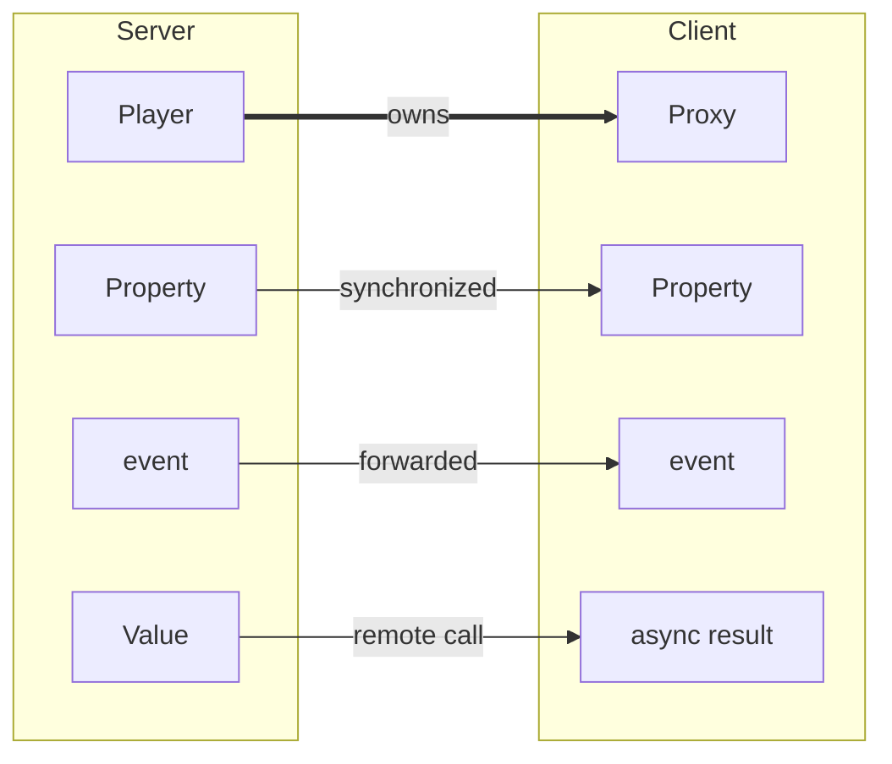

# PinionCore Remote
[](https://codeclimate.com/github/jiowchern/PinionCore.Remote/maintainability)
[](https://github.com/jiowchern/PinionCore.Remote/actions/workflows/dotnet-desktop.yml)
[](https://coveralls.io/github/jiowchern/PinionCore.Remote?branch=master)

[](https://deepwiki.com/jiowchern/PinionCore.Remote)
[](https://discord.gg/XqHghZ4MEc)
> **像使用本地物件一樣使用遠端 C# 物件。**

PinionCore.Remote 是一個專為 C# 與 Unity 打造的**分散式物件框架（Distributed Object Framework）**。

它建立在一個簡單的理念之上：

> **分散式程式設計應該感覺像一般的物件導向程式設計。**

你不是公開遠端程序，而是公開遠端物件。

你不是手動同步狀態，而是直接操作屬性。

你不是維護物件表與訊息派發器，而是單純地使用 C# 介面。

不需要 `.proto`。

不需要 DTO 對應。

不需要訊息 ID。

只需要 C# 介面。

```csharp
public interface IPlayer
{
    Property<string> Name { get; }

    Property<int> Hp { get; }

    event Action<int> Damaged;

    Value<bool> Attack(int targetId);
}
```

```csharp
agent.QueryNotifier<IPlayer>().Supply += player =>
{
    Console.WriteLine(player.Name.Value);

    player.Damaged += damage =>
    {
        Console.WriteLine($"-{damage}");
    };

    player.Attack(enemyId);
};
```

當伺服器建立一個 player 時，客戶端會自動收到它。

當伺服器銷毀它時，客戶端會自動收到 `Unsupply`。

物件就這樣自然地出現與消失。

---

# 為什麼不是 RPC？

如果你熟悉 **gRPC** 或 **MagicOnion**，請把 PinionCore.Remote 想成一個**分散式物件框架**，而不是 RPC 框架。

RPC 框架公開的是服務。

PinionCore.Remote 公開的是物件。

|                | gRPC / MagicOnion        | PinionCore.Remote   |
| -------------- | ------------------------ | ------------------- |
| 程式設計模型   | 遠端程序                 | 分散式物件          |
| 合約           | `.proto` 或服務介面      | 純 C# 介面          |
| 主要抽象       | 服務                     | 物件                |
| 狀態同步       | 手動                     | `Property<T>`       |
| 伺服器事件     | 串流                     | `event`             |
| 物件探索       | 手動                     | `QueryNotifier<T>`  |
| 物件生命週期   | 手動                     | `Supply / Unsupply` |

目標不是讓 RPC 更容易。

目標是讓分散式程式設計感覺像一般的物件導向程式設計。

---

# 運作原理


```mermaid
flowchart LR
    subgraph Server
        Player["Player"]
        SProp["Property<T>"]
        SEvent["event"]
        SValue["Value<T>"]
    end

    subgraph Client
        Proxy["Proxy"]
        CProp["Property<T>"]
        CEvent["event"]
        CResult["async result"]
    end

    Player ==>|owns| Proxy
    SProp -->|synchronized| CProp
    SEvent -->|forwarded| CEvent
    SValue -->|remote call| CResult
```

伺服器擁有真實的物件。

客戶端擁有一個即時的代理（proxy）。

屬性保持同步。

事件自動轉發。

方法呼叫轉換為遠端呼叫。

---

# 適用場景

PinionCore.Remote 非常適合那些物件天生具有身分、生命週期與行為的系統。

* 多人遊戲
* MMO 伺服器
* 分散式模擬
* 數位分身（Digital Twins）
* 類 Actor 系統
* 企業級分散式服務
* 物件同步

---

# 生態系

PinionCore.Remote 是一個持續成長的生態系的基礎。

## PinionCore Gateway

一個完全建構在 PinionCore.Remote 之上的分散式閘道。

它證明了 PinionCore.Remote 不僅止於簡單的客戶端／伺服器通訊，還能用來建構以服務為導向的分散式架構。

這個閘道本身使用的，正是每位開發者都能使用的相同公開 API——沒有任何內部捷徑或特殊協議。

功能包括：

* 服務路由
* 身分驗證
* 服務探索
* 分散式部署
* 負載平衡

---

# 像撰寫本地軟體一樣撰寫分散式軟體。

你不需要手動同步物件。

你不需要維護物件表。

你不需要實作訊息派發器。

你不需要指派訊息 ID。

你只需要操作物件。

---

# 文件
- [簡介與線上文件](docs/readme/tc/introduction.md)
- [核心特色](docs/readme/tc/core-features.md)
- [架構與模組總覽](docs/readme/tc/architecture.md)
- [快速開始（Hello World）](docs/readme/tc/quick-start.md)
- [核心概念詳解](docs/readme/tc/core-concepts.md)
- [傳輸模式與 Standalone](docs/readme/tc/transports.md)
- [進階主題](docs/readme/tc/advanced-topics.md)
- [範例與結語](docs/readme/tc/samples-and-tests.md)
