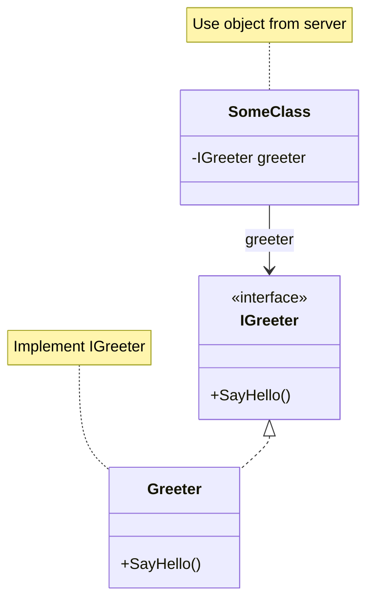




# PinionCore Remote
[](https://codeclimate.com/github/jiowchern/PinionCore.Remote/maintainability)
[](https://github.com/jiowchern/PinionCore.Remote/actions/workflows/dotnet-desktop.yml)
[](https://coveralls.io/github/jiowchern/PinionCore.Remote?branch=master)

[](https://deepwiki.com/jiowchern/PinionCore.Remote)
[Ask OpenDeepWiki](https://opendeep.wiki/jiowchern/PinionCore.Remote/introduction?branch=master)  

<!-- [](https://discord.gg/uDF8NTp) -->
<!-- [](https://ci.appveyor.com/project/jiowchern/regulus-remote/branch/release) -->
<!-- [](https://github.com/jiowchern/PinionCore/releases) -->
<!-- [](https://gitter.im/PinionCore-Library) -->

<!--  -->
[中文說明](README-tc.md)

---

## Introduction

PinionCore Remote is an object‑oriented remote communication framework written in C#.
You define your protocol as interfaces, implement them on the server, and call them from the client as if they were local objects. The real data is transported over TCP, WebSocket, or an in‑memory standalone mode.

- Targets .NET Standard 2.1 (runs on .NET 6/7/8 and Unity 2021+)
- Supports IL2CPP and AOT (types must be pre‑registered for serialization)
- Built‑in TCP, WebSocket and Standalone transports
- Uses a source generator to automatically create `IProtocol` implementations and reduce maintenance cost

---

## Key Features

### 1. Interface‑driven communication

You only need to define interfaces – no handwritten serialization or protocol parsing:

```csharp
public interface IGreeter
{
    PinionCore.Remote.Value<HelloReply> SayHello(HelloRequest request);
}
```

Server side:

```csharp
class Greeter : IGreeter
{
    PinionCore.Remote.Value<HelloReply> IGreeter.SayHello(HelloRequest request)
    {
        return new HelloReply { Message = $"Hello {request.Name}." };
    }
}
```

On the client you obtain a remote proxy via `QueryNotifier<IGreeter>()` and call `SayHello` directly. The return type `Value<T>` can be awaited.

### 2. Controlled lifecycle (Entry / Session / Soul)

The server entry implements `PinionCore.Remote.IEntry`. When a new connection is established you receive an `ISessionBinder` and decide when to bind or unbind interfaces:

```csharp
public class Entry : PinionCore.Remote.IEntry
{
    private readonly Greeter _greeter = new Greeter();

    void PinionCore.Remote.ISessionObserver.OnSessionOpened(PinionCore.Remote.ISessionBinder binder)
    {
        binder.Bind<IGreeter>(_greeter);
    }

    void PinionCore.Remote.ISessionObserver.OnSessionClosed(PinionCore.Remote.ISessionBinder binder)
    {
        // Cleanup when the client disconnects
    }

    void PinionCore.Remote.IEntry.Update()
    {
        // Optional server update loop
    }
}
```

`Soul` manages all connections and sessions: `new PinionCore.Remote.Server.Host(entry, protocol)` wraps the underlying `PinionCore.Remote.Soul.Service`.

### 3. Value / Property / Notifier

- `Value<T>`: asynchronous single result (see `PinionCore.Utility/PinionCore.Utility/Remote/Value.cs`)
- `Property<T>`: synchronized state (`PinionCore.Remote/Property.cs`)
- `Notifier<T>`: supply/unsupply object notifications (`PinionCore.Remote/Notifier.cs`)

Example RPG‑style interfaces:

```csharp
public interface IActor
{
    PinionCore.Remote.Property<string> Name { get; }
    PinionCore.Remote.Property<int> Level { get; }
}
```

```csharp
public interface IPlayer : IActor
{
    PinionCore.Remote.Notifier<IActor> VisibleActors { get; } // actors the player can see
    PinionCore.Remote.Property<int> Gold { get; }             // player‑only state
    PinionCore.Remote.Value<Path> Move(Position position);    // move command
    event System.Action<Position> StopEvent;                  // stop event
}
```

From the client side these feel like local objects whose changes are synchronized through the framework.

### 4. Realtime notifications with Notifier

`Notifier<T>` lets the server work with a single collection while clients automatically receive supply/unsupply notifications:

```csharp
class GameServer : IGameServer
{
    private readonly PinionCore.Remote.Depot<IPlayer> _players = new PinionCore.Remote.Depot<IPlayer>();

    public PinionCore.Remote.Notifier<IPlayer> Players { get; }

    public GameServer()
    {
        Players = new PinionCore.Remote.Notifier<IPlayer>(_players);
    }

    void OnPlayerJoin(IPlayer player)
    {
        _players.Items.Add(player);    // all clients receive Supply
    }

    void OnPlayerLeave(IPlayer player)
    {
        _players.Items.Remove(player); // all clients receive Unsupply
    }
}
```

Client side:

```csharp
agent.QueryNotifier<IPlayer>().Supply += player =>
{
    // handle new player joining
};
```

### 5. Nested interfaces and composite structures

Interfaces can inherit and be composed to align your protocol with the domain model:

```csharp
public interface IParty
{
    PinionCore.Remote.Notifier<IPlayer> Members { get; }
}

public interface IPartyService
{
    PinionCore.Remote.Value<IParty> CreateParty();
}
```

The source generator handles nested interfaces and the special types `Value<T>`, `Notifier<T>`, `Property<T>`, etc.

### 6. Reactive style methods

`PinionCore.Remote.Reactive` provides Rx extensions so you can work with `IObservable<T>` instead of callbacks.

Key extensions in `PinionCore.Remote.Reactive.Extensions`:

- `RemoteValue()`: convert `Value<T>` into `IObservable<T>`
- `SupplyEvent()` / `UnsupplyEvent()`: convert `Notifier<T>` events into `IObservable<T>`

From `PinionCore.Integration.Tests/SampleTests.cs`:

```csharp
// Important: the Rx flow still needs a background loop
var cts = new CancellationTokenSource();
var runTask = Task.Run(async () =>
{
    while (!cts.Token.IsCancellationRequested)
    {
        proxy.Agent.HandlePackets();
        proxy.Agent.HandleMessages();
        await Task.Delay(1, cts.Token);
    }
}, cts.Token);

// Build an Rx query
var echoObs =
    from e in proxy.Agent
        .QueryNotifier<PinionCore.Remote.Tools.Protocol.Sources.TestCommon.Echoable>()
        .SupplyEvent()
    from val in e.Echo().RemoteValue()
    select val;

var echoValue = await echoObs.FirstAsync();

cts.Cancel();
await runTask;
```

This demonstrates:

- A background processing loop is still required (HandlePackets/HandleMessages)
- Waiting for the server to supply an interface via `SupplyEvent()`
- Calling a remote `Echo()` that returns `Value<int>`
- Converting it into `IObservable<int>` with `RemoteValue()` and consuming with Rx

### 7. Multiple transports and Standalone mode

Built‑in transports:

- TCP: `PinionCore.Remote.Server.Tcp.ListeningEndpoint` / `PinionCore.Remote.Client.Tcp.ConnectingEndpoint`
- WebSocket: `PinionCore.Remote.Server.Web.ListeningEndpoint` / `PinionCore.Remote.Client.Web.ConnectingEndpoint`
- Standalone: `PinionCore.Remote.Standalone.ListeningEndpoint` (in‑memory server + client, ideal for tests and offline simulation)

The integration tests (`PinionCore.Integration.Tests/SampleTests.cs`) start all three endpoints and validate that their behavior is consistent.

---

## Architecture and Modules

Main projects:

- `PinionCore.Remote`: core abstractions (`IEntry`, `ISessionBinder`, `Value<T>`, `Property<T>`, `Notifier<T>`, etc.)
- `PinionCore.Remote.Client`: proxy, `IConnectingEndpoint`, and connection helpers (`AgentExtensions.Connect`)
- `PinionCore.Remote.Server`: host, `IListeningEndpoint`, `ServiceExtensions.ListenAsync`
- `PinionCore.Remote.Soul`: server‑side session management and update loop (`ServiceUpdateLoop`)
- `PinionCore.Remote.Ghost`: client‑side agent implementation (`User`), packet encoding/decoding
- `PinionCore.Remote.Standalone`: in‑memory `ListeningEndpoint` implementing both server and client endpoints
- `PinionCore.Network`: `IStreamable`, TCP/WebSocket peers, low‑level packet IO
- `PinionCore.Serialization`: default serialization and type descriptors
- `PinionCore.Remote.Tools.Protocol.Sources`: source generator; uses `[PinionCore.Remote.Protocol.Creator]` to generate `IProtocol`
- `PinionCore.Remote.Gateway`: gateway and multi‑service routing (see that module’s README for details)

Conceptual diagram (simplified):



---

## Quickstart (Hello World)

The recommended layout is three projects: `Protocol`, `Server`, `Client`. The examples here mirror the official samples in `PinionCore.Samples.HelloWorld.*`.

### Environment

- .NET SDK 6 or later
- Visual Studio 2022 / Rider / VS Code
- For Unity, Unity 2021 LTS or later is recommended

### 1. Protocol project

Create a class library:

```bash
Sample/Protocol> dotnet new classlib
```

Add package references (use the latest published versions in your project):

```xml
<ItemGroup>
  <PackageReference Include="PinionCore.Remote" Version="0.1.14.15" />
  <PackageReference Include="PinionCore.Serialization" Version="0.1.14.12" />
  <PackageReference Include="PinionCore.Remote.Tools.Protocol.Sources" Version="0.0.4.25">
    <PrivateAssets>all</PrivateAssets>
    <IncludeAssets>runtime; build; native; contentfiles; analyzers; buildtransitive</IncludeAssets>
  </PackageReference>
</ItemGroup>
```

Define request/response types and the interface:

```csharp
namespace Protocol
{
    public struct HelloRequest
    {
        public string Name;
    }

    public struct HelloReply
    {
        public string Message;
    }

    public interface IGreeter
    {
        PinionCore.Remote.Value<HelloReply> SayHello(HelloRequest request);
    }
}
```

Create the `ProtocolCreator` entry point for the source generator:

```csharp
namespace Protocol
{
    public static partial class ProtocolCreator
    {
        public static PinionCore.Remote.IProtocol Create()
        {
            PinionCore.Remote.IProtocol protocol = null;
            _Create(ref protocol);
            return protocol;
        }

        [PinionCore.Remote.Protocol.Creator]
        static partial void _Create(ref PinionCore.Remote.IProtocol protocol);
    }
}
```

> The method marked with `[PinionCore.Remote.Protocol.Creator]` must have the signature  
> `static partial void Method(ref PinionCore.Remote.IProtocol protocol);`  
> otherwise code generation will fail.

### 2. Server project

Create a console project:

```bash
Sample/Server> dotnet new console
```

Add references:

```xml
<ItemGroup>
  <PackageReference Include="PinionCore.Remote.Server" Version="0.1.14.13" />
  <ProjectReference Include="..\Protocol\Protocol.csproj" />
</ItemGroup>
```

Implement `IGreeter` (mirrors `PinionCore.Samples.HelloWorld.Server/Greeter.cs`):

```csharp
using Protocol;

namespace Server
{
    class Greeter : IGreeter
    {
        PinionCore.Remote.Value<HelloReply> IGreeter.SayHello(HelloRequest request)
        {
            return new HelloReply { Message = $"Hello {request.Name}." };
        }
    }
}
```

Implement `Entry`:

```csharp
using PinionCore.Remote;
using Protocol;

namespace Server
{
    class Entry : IEntry
    {
        public volatile bool Enable = true;

        private readonly Greeter _greeter = new Greeter();

        void ISessionObserver.OnSessionOpened(ISessionBinder binder)
        {
            // Client connected, bind IGreeter
            var soul = binder.Bind<IGreeter>(_greeter);
            // You can later unbind with binder.Unbind(soul);
        }

        void ISessionObserver.OnSessionClosed(ISessionBinder binder)
        {
            // Cleanup when the client disconnects
            Enable = false;
        }

        void IEntry.Update()
        {
            // Optional server update loop
        }
    }
}
```

Server startup (based on the HelloWorld sample):

```csharp
using System;
using System.Threading.Tasks;
using PinionCore.Remote.Server;
using Protocol;

namespace Server
{
    internal class Program
    {
        static async Task Main(string[] args)
        {
            int port = int.Parse(args[0]);

            var protocol = ProtocolCreator.Create();
            var entry = new Entry();

            var host = new PinionCore.Remote.Server.Host(entry, protocol);
            PinionCore.Remote.Soul.IService service = host;

            var (disposeServer, errorInfos) = await service.ListenAsync(
                new PinionCore.Remote.Server.Tcp.ListeningEndpoint(port, 10));

            foreach (var error in errorInfos)
            {
                Console.WriteLine($"Listener error: {error.Exception}");
                return;
            }

            Console.WriteLine("Server started.");

            while (entry.Enable)
            {
                System.Threading.Thread.Sleep(0);
                // You can also call entry.Update() here if needed
            }

            disposeServer.Dispose();
            host.Dispose();

            Console.WriteLine("Press any key to exit.");
            Console.ReadKey();
        }
    }
}
```

### 3. Client project

Create a console project:

```bash
Sample/Client> dotnet new console
```

Add references:

```xml
<ItemGroup>
  <PackageReference Include="PinionCore.Remote.Client" Version="0.1.14.12" />
  <PackageReference Include="PinionCore.Remote.Reactive" Version="0.1.14.13" />
  <ProjectReference Include="..\Protocol\Protocol.csproj" />
</ItemGroup>
```

Client program (aligned with the HelloWorld client sample):

```csharp
using System;
using System.Net;
using System.Threading.Tasks;
using PinionCore.Remote.Client;
using Protocol;

namespace Client
{
    internal class Program
    {
        private static bool _enable = true;

        static void Main(string[] args)
        {
            _Run(args).Wait();
        }

        private static async Task _Run(string[] args)
        {
            var ip = IPAddress.Parse(args[0]);
            var port = int.Parse(args[1]);

            var protocol = ProtocolCreator.Create();
            var proxy = new Proxy(protocol);
            var agent = proxy.Agent;

            var endpoint = new PinionCore.Remote.Client.Tcp.ConnectingEndpoint(
                new IPEndPoint(ip, port));

            // Connect() is an extension method on AgentExtensions:
            // it calls Enable(stream) and returns an IDisposable.
            // Disposing it will automatically call Disable() and dispose the endpoint.
            var connection = await agent.Connect(endpoint).ConfigureAwait(false);

            agent.QueryNotifier<IGreeter>().Supply += greeter =>
            {
                var request = new HelloRequest { Name = "you" };
                greeter.SayHello(request).OnValue += _OnReply;
            };

            // You must keep processing packets and messages
            while (_enable)
            {
                System.Threading.Thread.Sleep(0);
                agent.HandleMessages();
                agent.HandlePackets();
            }

            connection.Dispose();
            Console.WriteLine("Press any key to exit.");
            Console.ReadKey();
        }

        private static void _OnReply(HelloReply reply)
        {
            Console.WriteLine($"Receive message: {reply.Message}");
            _enable = false;
        }
    }
}
```

---

## Core Concepts

### IEntry / ISessionBinder / ISoul

- `IEntry`: server entry point, responsible for session open/close and optional update loop
- `ISessionBinder`: passed into `OnSessionOpened`, used to `Bind<T>()` / `Unbind(ISoul)`
- `ISoul`: represents a bound instance attached to a session; later used for unbinding or querying

Relevant interfaces:

- `PinionCore.Remote/IEntry.cs`
- `PinionCore.Remote/ISessionObserver.cs`
- `PinionCore.Remote/ISessionBinder.cs`
- `PinionCore.Remote/ISoul.cs`

`PinionCore.Remote.Soul.Service` manages sessions internally via `SessionEngine`, and `PinionCore.Remote.Server.Host` wraps it for easier service construction.

### Value\<T>

`Value<T>` represents a single remote result:

- Supports both `OnValue` event and `await`
- The value is set exactly once
- You typically return plain `T` and rely on implicit conversion:

```csharp
return new HelloReply { Message = "..." }; // implicitly converted to Value<HelloReply>
```

Implementation: `PinionCore.Utility/PinionCore.Utility/Remote/Value.cs`

### Property\<T>

`Property<T>` is a stateful value with change notifications:

- Updating `Value` triggers `DirtyEvent`
- `PropertyObservable` in `PinionCore.Remote.Reactive/PropertyObservable.cs` turns it into `IObservable<T>`
- Implicit conversion to `T` makes it feel like a normal property

Implementation: `PinionCore.Remote/Property.cs`

### Notifier\<T> and Depot\<T>

`Depot<T>` (`PinionCore.Utility/Remote/Depot.cs`) combines a collection with notification:

- `Items.Add(item)` triggers `Supply`
- `Items.Remove(item)` triggers `Unsupply`

`Notifier<T>` wraps `Depot<TypeObject>` and supports cross‑type queries and event subscriptions.

`INotifierQueryable` (`PinionCore.Remote/INotifierQueryable.cs`) allows:

```csharp
INotifier<T> QueryNotifier<T>();
```

`Ghost.User` implements `INotifierQueryable`, so clients can obtain `Notifier<T>` for any interface via `QueryNotifier<T>()`.

### Streamable methods

If an interface defines a method like:

```csharp
PinionCore.Remote.IAwaitableSource<int> StreamEcho(
    byte[] buffer,
    int offset,
    int count);
```

The source generator treats it as a **streamable method**:

- Only `buffer[offset..offset + count)` is transmitted
- The server writes the result back into the same slice
- The returned `IAwaitableSource<int>` represents the actual processed length

Validation logic lives in `PinionCore.Remote.Tools.Protocol.Sources/MethodPinionCoreRemoteStreamable.cs`.

---

## Transport Modes and Standalone

### TCP

Server:

```csharp
var host = new PinionCore.Remote.Server.Host(entry, protocol);
PinionCore.Remote.Soul.IService service = host;
var (disposeServer, errorInfos) = await service.ListenAsync(
    new PinionCore.Remote.Server.Tcp.ListeningEndpoint(port, backlog: 10));
```

Client:

```csharp
var proxy = new PinionCore.Remote.Client.Proxy(protocol);
using var connection = await proxy.Connect(
    new PinionCore.Remote.Client.Tcp.ConnectingEndpoint(
        new System.Net.IPEndPoint(System.Net.IPAddress.Loopback, port)));
```

### WebSocket

Server:

```csharp
var (disposeServer, errorInfos) = await service.ListenAsync(
    new PinionCore.Remote.Server.Web.ListeningEndpoint($"http://localhost:{webPort}/"));
```

Client:

```csharp
var proxy = new PinionCore.Remote.Client.Proxy(protocol);
using var connection = await proxy.Connect(
    new PinionCore.Remote.Client.Web.ConnectingEndpoint(
        $"ws://localhost:{webPort}/"));
```

`PinionCore.Remote.Client.Web.ConnectingEndpoint` uses `System.Net.WebSockets.ClientWebSocket` together with `PinionCore.Network.Web.Peer`.

### Standalone (in‑memory simulation)

`PinionCore.Remote.Standalone.ListeningEndpoint` implements both:

- `PinionCore.Remote.Server.IListeningEndpoint`
- `PinionCore.Remote.Client.IConnectingEndpoint`

Usage (same as in `SampleTests`):

```csharp
var protocol = ProtocolCreator.Create();
var entry = new Entry();
var host = new PinionCore.Remote.Server.Host(entry, protocol);
PinionCore.Remote.Soul.IService service = host;

var standaloneEndpoint = new PinionCore.Remote.Standalone.ListeningEndpoint();

var (disposeServer, errors) = await service.ListenAsync(standaloneEndpoint);
```

This lets you run both server and client in the same process without any real network, which is ideal for development and integration tests.

---

## Advanced Topics

### Reactive extensions

`PinionCore.Remote.Reactive/Extensions.cs` provides:

- `ReturnVoid(this Action)`: wrap an `Action` as `IObservable<Unit>`
- `RemoteValue(this Value<T>)`: convert a remote `Value<T>` into `IObservable<T>`
- `PropertyChangeValue(this Property<T>)`: convert property changes into `IObservable<T>`
- `SupplyEvent` / `UnsupplyEvent(this INotifier<T>)`: convert notifier events into `IObservable<T>`

In `SampleTests` the Rx chain is roughly:

1. Wait for the `Echoable` interface to be supplied:

   ```csharp
   proxy.Agent.QueryNotifier<Echoable>().SupplyEvent()
   ```

2. Call remote `Echo()` and project the result via `RemoteValue()`:

   ```csharp
   from e in ...
   from val in e.Echo().RemoteValue()
   select val;
   ```

This style is well‑suited when you need to compose multiple sequential remote calls.

### Gateway module

`PinionCore.Remote.Gateway` provides:

- Multi‑service entry (router)
- Grouping and load balancing (`LineAllocator`)
- Version coexistence (different `IProtocol.VersionCode`)
- Gateway control flow as used by the Chat1 sample

See `PinionCore.Remote.Gateway/README.md` and the `PinionCore.Consoles.Chat1.*` projects for details.

### Custom connections

If the built‑in TCP/WebSocket transports do not meet your needs, you can implement:

- `PinionCore.Network.IStreamable` (read/write `byte[]`)
- `PinionCore.Remote.Client.IConnectingEndpoint`
- `PinionCore.Remote.Server.IListeningEndpoint`

The usage pattern is the same as with built‑in endpoints; only the underlying transport or protocol differs.

### Custom serialization

To customize serialization, use the low‑level types instead of the convenience wrappers.

**Server (using `PinionCore.Remote.Soul.Service`):**

```csharp
var serializer = new YourSerializer();
var internalSerializer = new YourInternalSerializer();
var pool = PinionCore.Memorys.PoolProvider.Shared;

// Use Soul.Service directly (full control), not Server.Host
var service = new PinionCore.Remote.Soul.Service(entry, protocol, serializer, internalSerializer, pool);
```

**Client (using `PinionCore.Remote.Ghost.Agent`):**

```csharp
var serializer = new YourSerializer();
var internalSerializer = new YourInternalSerializer();
var pool = PinionCore.Memorys.PoolProvider.Shared;

// Use Ghost.Agent directly (full control), not Client.Proxy
var agent = new PinionCore.Remote.Ghost.Agent(protocol, serializer, internalSerializer, pool);
```

Mapping between convenience wrappers and full types:

- `Server.Host` internally uses `Soul.Service` with default serializers
- `Client.Proxy` internally uses `Ghost.Agent` with default serializers

Types that need serialization can be retrieved from `IProtocol.SerializeTypes`, or see `PinionCore.Serialization/README.md` for more information.

---

## Samples and Tests

Recommended projects to read:

- `PinionCore.Samples.Helloworld.Protocols`: basic protocol and `ProtocolCreator` implementation
- `PinionCore.Samples.Helloworld.Server`: `Entry`, `Greeter`, and host usage
- `PinionCore.Samples.Helloworld.Client`: `Proxy`, `ConnectingEndpoint`, and `QueryNotifier`
- `PinionCore.Integration.Tests/SampleTests.cs` (highly recommended):
  - Starts TCP, WebSocket, and Standalone endpoints in parallel
  - Demonstrates using Rx (`SupplyEvent` / `RemoteValue`) to handle remote calls
  - Includes detailed English comments explaining each step and the need for the background loop
  - Verifies consistent behavior across all transport modes
- `PinionCore.Remote.Gateway` + `PinionCore.Consoles.Chat1.*`: real‑world gateway scenario

---

## Build, Test and Pack

At the repository root:

```bash
dotnet restore
dotnet build --configuration Release --no-restore
```

Run all tests and collect coverage:

```bash
dotnet test /p:CollectCoverage=true \
            /p:CoverletOutput=../CoverageResults/ \
            /p:MergeWith="../CoverageResults/coverage.json" \
            /p:CoverletOutputFormat="lcov%2cjson" -m:1
```

Pack NuGet packages:

```bash
dotnet pack --configuration Release --output ./nupkgs
```

Run a single test project:

```bash
dotnet test PinionCore.Integration.Tests/PinionCore.Integration.Tests.csproj
```

---

## Closing Notes

PinionCore Remote aims to remove low‑level packet formats and serialization details from your daily work by using **interface‑driven communication** between server and client. You focus on your domain model and state management; the framework handles connections, serialization, object supply/unsupply, and version checks.

Whether you are building games, real‑time services, tools backends, or aggregating multiple services through the gateway, as long as your requirement is “call remote objects as if they were local interfaces across processes or machines”, PinionCore Remote is designed to be a solid foundation.

If you are new to the project, start with `PinionCore.Samples.HelloWorld.*`, follow the Quickstart steps to build `Protocol`, `Server`, and `Client`, then read `PinionCore.Integration.Tests` (especially `SampleTests`) and the gateway samples to see how everything fits together. When you need more advanced capabilities, such as custom transports or serialization, refer back to the Advanced Topics section and the corresponding source files.

If you find anything unclear in the documentation, see gaps in the samples, or encounter real‑world scenarios that are not covered, please feel free to open an issue or send a PR. Improvements such as better explanations, typo fixes, additional small samples, or new integration tests all make the framework easier for the next user to adopt.

We hope PinionCore Remote can save you time dealing with networking details so you can focus on designing the game and applications that actually matter.
