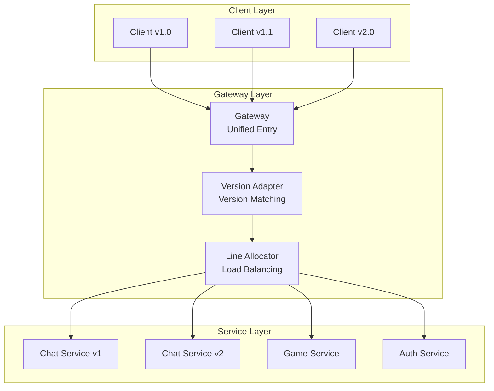

# PinionCore Remote
[](https://codeclimate.com/github/jiowchern/PinionCore.Remote/maintainability)
[](https://github.com/jiowchern/PinionCore.Remote/actions/workflows/dotnet-desktop.yml)
[](https://coveralls.io/github/jiowchern/PinionCore.Remote?branch=master)

[](https://deepwiki.com/jiowchern/PinionCore.Remote)  
[Ask OpenDeepWiki](https://opendeep.wiki/jiowchern/PinionCore.Remote/introduction?branch=master)

---

## Table of Contents

- [Introduction](#introduction)
- [Core Features](#core-features)
  - [Interface-Oriented Communication](#1-interface-oriented-communication)
  - [Controllable Lifecycle (Entry / Session / Soul)](#2-controllable-lifecycle-entry--session--soul)
  - [Value / Property / Notifier Support](#3-value--property--notifier-support)
  - [Reactive Support](#4-reactive-support)
  - [Public & Private Interfaces](#5-public--private-interface-support)
  - [Multiple Transport Modes & Standalone](#6-multiple-transport-modes--standalone)
  - [Gateway Service](#7-gateway-service)
- [Architecture & Module Overview](#architecture--module-overview)
- [Quick Start (Hello World)](#quick-start-hello-world)
  - [Environment Requirements](#environment-requirements)
  - [1. Protocol Project](#1-protocol-project)
  - [2. Server Project](#2-server-project)
  - [3. Client Project](#3-client-project)
- [Detailed Core Concepts](#detailed-core-concepts)
  - [IEntry / ISessionBinder / ISoul](#ientry--isessionbinder--isoul)
  - [Value\<T>](#valuet)
  - [Property\<T>](#propertyt)
  - [Notifier\<T> & Depot\<T>](#notifiert--depott)
  - [Streamable Methods](#streamable-methods)
- [Transport Modes & Standalone](#transport-modes--standalone)
  - [TCP](#tcp)
  - [WebSocket](#websocket)
  - [Standalone (Simulation)](#standalone-simulation)
- [Advanced Topics](#advanced-topics)
  - [Reactive Extensions](#reactive-extensions)
  - [Gateway Module](#gateway-module)
  - [Custom Connections](#custom-connections)
  - [Custom Serialization](#custom-serialization)
- [Samples & Tests](#samples--tests)
- [Conclusion](#conclusion)

---

## Introduction

**PinionCore Remote** is an interface-oriented remote communication framework built in C#.

You define **interfaces** as remote protocols.  
Servers implement these interfaces, and clients invoke them as if they were local methods;  
actual data is transmitted through **TCP / WebSocket / Standalone (in-process simulation)**.

- Supports **.NET Standard 2.1** (.NET 6/7/8, Unity 2021+)
- Supports **IL2CPP & AOT** (requires pre-registered serialization types)
- Built-in **TCP**, **WebSocket**, and **Standalone** transport modes
- Uses **Source Generator** to automatically generate `IProtocol` implementation
- Based on **Value / Property / Notifier** to describe remote behaviors & states
- Works with **PinionCore.Remote.Reactive** to write remote workflows in Rx style

---

## Online Documentation

- [DeepWiki](https://deepwiki.com/jiowchern/PinionCore.Remote)
- [OpenDeepWiki](https://opendeep.wiki/jiowchern/PinionCore.Remote/introduction?branch=master)
## Core Features

### 1. Interface-Oriented Communication

You only need to define interfaces — no manual serialization or protocol parsing is required:

```csharp
public interface IGreeter
{
    PinionCore.Remote.Value<HelloReply> SayHello(HelloRequest request);
}
```

Server implementation:

```csharp
class Greeter : IGreeter
{
    PinionCore.Remote.Value<HelloReply> IGreeter.SayHello(HelloRequest request)
    {
        return new HelloReply { Message = $"Hello {request.Name}." };
    }
}
```

Client uses `QueryNotifier<IGreeter>()` to get a remote proxy and call it like a local object:

```csharp
agent.QueryNotifier<IGreeter>().Supply += greeter =>
{
    var request = new HelloRequest { Name = "you" };
    greeter.SayHello(request).OnValue += reply =>
    {
        Console.WriteLine($"Receive message: {reply.Message}");
    };
};
```

- `Value<T>` can be awaited or listened through `OnValue`.
- No need to handle connection ID / RPC ID — just follow the interface.

---

### 2. Controllable Lifecycle (Entry / Session / Soul)

Server implements `IEntry`.  
Lifecycle callbacks are triggered automatically when sessions open or close:

```csharp
public class Entry : PinionCore.Remote.IEntry
{
    private readonly Greeter _greeter = new Greeter();

    void PinionCore.Remote.ISessionObserver.OnSessionOpened(PinionCore.Remote.ISessionBinder binder)
    {
        // Client connected — bind _greeter
        var soul = binder.Bind<IGreeter>(_greeter);

        // To unbind later:
        // binder.Unbind(soul);
    }

    void PinionCore.Remote.ISessionObserver.OnSessionClosed(PinionCore.Remote.ISessionBinder binder)
    {
        // Cleanup when client disconnects
    }

    void PinionCore.Remote.IEntry.Update()
    {
        // Server update loop (optional)
    }
}
```

Running the server:

```csharp
var host = new PinionCore.Remote.Server.Host(entry, protocol);
// Host internally uses SessionEngine to manage sessions
```

---

### 3. Value / Property / Notifier Support

PinionCore Remote focuses on interfaces and provides three major member types.

---

#### Value<T>: One-Time Async Call

- Behaves like `Task<T>`.
- Used for request/response flows.
- Set only once; supports both `await` and `OnValue`.

```csharp
Value<LoginResult> Login(LoginRequest request);
```

---

#### Property<T>: Persistent Remote State

- Server maintains the actual value.
- Client gets updates when the value changes.
- Suitable for things like: player name, room title, server version.

```csharp
Property<string> Nickname { get; }
Property<string> RoomName { get; }
```

---

#### Notifier<T>: Dynamic Remote Object Collections

Used to describe dynamic sets of remote objects, suitable for nested structures:

```csharp
public interface IChatEntry
{
    INotifier<IRoom> Rooms { get; }
}

public interface IRoom
{
    Property<string> Name { get; }
    INotifier<IPlayer> Players { get; }
}

public interface IPlayer
{
    Property<string> Nickname { get; }
}
```

Server-side actions:

- Create → `Rooms.Supply(roomImpl)`
- Remove → `Rooms.Unsupply(roomImpl)`
- Player joins → `room.Players.Supply(playerImpl)`
- Player leaves → `room.Players.Unsupply(playerImpl)`

Client:

```csharp
agent.QueryNotifier<IRoom>().Supply += room =>
{
    room.Players.Supply += player =>
    {
        Console.WriteLine($"Player joined: {player.Nickname.Value}");
    };
};
```

**Key points:**

- Notifier = dynamic object collection + remote object tree synchronization
- Client does not manage IDs; everything follows the interface hierarchy
### 4. Reactive Support

`PinionCore.Remote.Reactive` provides Rx (Reactive Extensions) support, allowing you to compose remote workflows using `IObservable<T>`.

Key extension methods (located in `PinionCore.Remote.Reactive.Extensions`):

- `RemoteValue()` — converts `Value<T>` to `IObservable<T>`
- `SupplyEvent()` / `UnsupplyEvent()` — converts `INotifier<T>` events to observables

Example extracted from `PinionCore.Integration.Tests/SampleTests.cs`:

```csharp
var cts = new CancellationTokenSource();
var runTask = Task.Run(async () =>
{
    while (!cts.Token.IsCancellationRequested)
    {
        proxy.Agent.HandlePackets();
        proxy.Agent.HandleMessages();
        await Task.Delay(1, cts.Token);
    }
}, cts.Token);

var echoObs =
    from e in proxy.Agent
        .QueryNotifier<Echoable>()
        .SupplyEvent()
    from val in e.Echo().RemoteValue()
    select val;

var echoValue = await echoObs.FirstAsync();

cts.Cancel();
await runTask;
```

Notes:

- Even when using Rx, **background loops are still required**  
  (`HandlePackets()` / `HandleMessages()` must be called continuously).
- Rx simply makes workflow composition easier; it does not replace low-level message handling.

---

### 5. Public & Private Interface Support

Since PinionCore Remote is interface-driven, the server can bind different interfaces based on client authentication or permissions, achieving clean “public vs. private” API separation.

```csharp
public interface IPublicService
{
    Value<string> GetPublicData();
}

public interface IPrivateService : IPublicService
{
    Value<string> GetPrivateData();
}

class ServiceImpl : IPrivateService
{
    public Value<string> GetPublicData() => "This is public data.";
    public Value<string> GetPrivateData() => "This is private data.";
}
```

Server-side:

```csharp
void ISessionObserver.OnSessionOpened(ISessionBinder binder)
{
    var serviceImpl = new ServiceImpl();

    if (IsAuthenticatedClient(binder))
    {
        binder.Bind<IPrivateService>(serviceImpl); // authenticated clients
    }

    binder.Bind<IPublicService>(serviceImpl);      // everyone gets this
}
```

- Unauthenticated clients → **IPublicService only**
- Authenticated clients → **IPublicService + IPrivateService**

---

### 6. Multiple Transport Modes & Standalone

PinionCore Remote includes three built-in transport modes:

#### **TCP**
- `PinionCore.Remote.Server.Tcp.ListeningEndpoint`
- `PinionCore.Remote.Client.Tcp.ConnectingEndpoint`

#### **WebSocket**
- `PinionCore.Remote.Server.Web.ListeningEndpoint`
- `PinionCore.Remote.Client.Web.ConnectingEndpoint`

#### **Standalone (In-Process Simulation)**
- `PinionCore.Remote.Standalone.ListeningEndpoint`  
  Acts as both server & client endpoints, ideal for testing

Integration tests (`SampleTests`) launch all three transports and ensure identical behavior across modes.

---

### 7. Gateway Service

**Purpose**:

`PinionCore.Remote.Gateway` provides enterprise-grade gateway capabilities, serving as a unified entry point for multiple backend services:

- **Multi-Service Routing**: Unified entry point distributing requests to different backend services (Chat, Game, Auth, etc.)
- **Version Coexistence**: Supports multiple protocol versions (`IProtocol.VersionCode`) simultaneously for smooth upgrades
- **Load Balancing**: `LineAllocator` provides service instance allocation and balancing
- **Service Isolation**: Independent deployment and scaling of services, unified management through Gateway

**Architecture Diagram**:



**Core Components**:

- **Router**: Routes requests based on protocol version and service type
- **LineAllocator**: Manages service instance groups, provides load balancing and fault tolerance
- **Version Adapter**: Handles coexistence of clients with different protocol versions, enabling zero-downtime upgrades

**Use Cases**:

- Running multiple independent services simultaneously (microservices architecture)
- Protocol version management and smooth upgrades
- Horizontal scaling and load balancing
- Unified connection management and monitoring entry point

For detailed documentation and examples, see `PinionCore.Remote.Gateway/README.md` and the `PinionCore.Consoles.Chat1.*` projects.

---

## Architecture & Module Overview

Main projects and their roles:

- **PinionCore.Remote**  
  - Core interfaces and abstractions: `IEntry`, `ISessionBinder`, `ISoul`  
  - State types: `Value<T>`, `Property<T>`, `Notifier<T>`

- **PinionCore.Remote.Client**  
  - `Proxy`, `IConnectingEndpoint`  
  - Connection utilities: `AgentExtensions.Connect`

- **PinionCore.Remote.Server**  
  - `Host`, `IListeningEndpoint`  
  - Service startup & listening: `ServiceExtensions.ListenAsync`

- **PinionCore.Remote.Soul**  
  - Server-side session management (`SessionEngine`)  
  - Update loop: `ServiceUpdateLoop`

- **PinionCore.Remote.Ghost**  
  - Client `Agent` implementation (`User`)  
  - Packet encoding & processing

- **PinionCore.Remote.Standalone**  
  - `ListeningEndpoint` that simulates both server and client in-memory

- **PinionCore.Network**  
  - `IStreamable` interface, TCP/WebSocket peers, packet read/write utilities

- **PinionCore.Serialization**  
  - Default serialization implementation and type descriptors (customizable)

- **PinionCore.Remote.Tools.Protocol.Sources**  
  - Source Generator  
  - Annotated with `[PinionCore.Remote.Protocol.Creator]` to auto-generate `IProtocol`

- **PinionCore.Remote.Gateway**  
  - Gateway / Router, multi-service routing, version coexistence  
  - See the module README for more details

---

## Quick Start (Hello World)

It is recommended to create three separate projects:  
**Protocol**, **Server**, and **Client**.

The following example is a simplified version.  
Full samples can be found in:

- `PinionCore.Samples.HelloWorld.Protocols`
- `PinionCore.Samples.HelloWorld.Server`
- `PinionCore.Samples.HelloWorld.Client`

---

### Environment Requirements

- .NET SDK 6 or later  
- Visual Studio 2022 / JetBrains Rider / VS Code  
- For Unity: Unity 2021 LTS or newer is recommended

---

### 1. Protocol Project

Create a Class Library:

```bash
Sample/Protocol> dotnet new classlib
```

Add NuGet references (version numbers may vary):

```xml
<ItemGroup>
  <PackageReference Include="PinionCore.Remote" Version="0.1.14.15" />
  <PackageReference Include="PinionCore.Serialization" Version="0.1.14.12" />
  <PackageReference Include="PinionCore.Remote.Tools.Protocol.Sources" Version="0.0.4.25">
    <PrivateAssets>all</PrivateAssets>
    <IncludeAssets>runtime; build; native; contentfiles; analyzers; buildtransitive</IncludeAssets>
  </PackageReference>
</ItemGroup>
```

Define data structures & interfaces (HelloWorld example):

```csharp
namespace Protocol
{
    public struct HelloRequest
    {
        public string Name;
    }

    public struct HelloReply
    {
        public string Message;
    }

    public interface IGreeter
    {
        PinionCore.Remote.Value<HelloReply> SayHello(HelloRequest request);
    }
}
```

Create `ProtocolCreator` (Source Generator entry point):

```csharp
namespace Protocol
{
    public static partial class ProtocolCreator
    {
        public static PinionCore.Remote.IProtocol Create()
        {
            PinionCore.Remote.IProtocol protocol = null;
            _Create(ref protocol);
            return protocol;
        }

        [PinionCore.Remote.Protocol.Creator]
        static partial void _Create(ref PinionCore.Remote.IProtocol protocol);
    }
}
```

**Note:**  
Methods marked with `[PinionCore.Remote.Protocol.Creator]`  
**must** have the following signature:

```
static partial void Method(ref PinionCore.Remote.IProtocol)
```

Otherwise the project will fail to compile.

### 2. Server Project

Create a Console App:

```bash
Sample/Server> dotnet new console
```

Add project references:

```xml
<ItemGroup>
  <PackageReference Include="PinionCore.Remote.Server" Version="0.1.14.13" />
  <ProjectReference Include="..\Protocol\Protocol.csproj" />
</ItemGroup>
```

Implement `IGreeter`:

```csharp
using Protocol;

namespace Server
{
    class Greeter : IGreeter
    {
        PinionCore.Remote.Value<HelloReply> IGreeter.SayHello(HelloRequest request)
        {
            return new HelloReply { Message = $"Hello {request.Name}." };
        }
    }
}
```

Implement `Entry`:

```csharp
using PinionCore.Remote;
using Protocol;

namespace Server
{
    class Entry : IEntry
    {
        public volatile bool Enable = true;
        private readonly Greeter _greeter = new Greeter();

        void ISessionObserver.OnSessionOpened(ISessionBinder binder)
        {
            // Client connected — bind IGreeter
            var soul = binder.Bind<IGreeter>(_greeter);
        }

        void ISessionObserver.OnSessionClosed(ISessionBinder binder)
        {
            // Logic when client disconnects
            Enable = false;
        }

        void IEntry.Update()
        {
            // Optional server update loop
        }
    }
}
```

Server startup entry point (TCP version):

```csharp
using System;
using System.Threading.Tasks;
using PinionCore.Remote.Server;
using Protocol;

namespace Server
{
    internal class Program
    {
        static async Task Main(string[] args)
        {
            int port = int.Parse(args[0]);

            var protocol = ProtocolCreator.Create();
            var entry = new Entry();

            var host = new PinionCore.Remote.Server.Host(entry, protocol);
            PinionCore.Remote.Soul.IService service = host;

            var (disposeServer, errorInfos) = await service.ListenAsync(
                new PinionCore.Remote.Server.Tcp.ListeningEndpoint(port, backlog: 10));

            foreach (var error in errorInfos)
            {
                Console.WriteLine($"Listener error: {error.Exception}");
                return;
            }

            Console.WriteLine("Server started.");

            while (entry.Enable)
            {
                System.Threading.Thread.Sleep(0);
                // Optionally call: entry.Update();
            }

            disposeServer.Dispose();
            host.Dispose();

            Console.WriteLine("Press any key to exit.");
            Console.ReadKey();
        }
    }
}
```

### 3. Client Project

Create a Console App:

```bash
Sample/Client> dotnet new console
```

Add references:

```xml
<ItemGroup>
  <PackageReference Include="PinionCore.Remote.Client" Version="0.1.14.12" />
  <PackageReference Include="PinionCore.Remote.Reactive" Version="0.1.14.13" />
  <ProjectReference Include="..\Protocol\Protocol.csproj" />
</ItemGroup>
```

A simplified client program:

```csharp
using System;
using System.Net;
using System.Threading.Tasks;
using PinionCore.Remote.Client;
using Protocol;

namespace Client
{
    internal class Program
    {
        private static bool _enable = true;

        static void Main(string[] args)
        {
            _Run(args).Wait();
        }

        private static async Task _Run(string[] args)
        {
            var ip = IPAddress.Parse(args[0]);
            var port = int.Parse(args[1]);

            var protocol = ProtocolCreator.Create();
            var proxy = new Proxy(protocol);
            var agent = proxy.Agent;

            var endpoint = new PinionCore.Remote.Client.Tcp.ConnectingEndpoint(
                new IPEndPoint(ip, port));

            // Connect() is in AgentExtensions
            var connection = await agent.Connect(endpoint).ConfigureAwait(false);

            agent.QueryNotifier<IGreeter>().Supply += greeter =>
            {
                var request = new HelloRequest { Name = "you" };
                greeter.SayHello(request).OnValue += _OnReply;
            };

            // Must continuously process packets and messages
            while (_enable)
            {
                System.Threading.Thread.Sleep(0);
                agent.HandleMessages();
                agent.HandlePackets();
            }

            connection.Dispose();
            Console.WriteLine("Press any key to exit.");
            Console.ReadKey();
        }

        private static void _OnReply(HelloReply reply)
        {
            Console.WriteLine($"Receive message: {reply.Message}");
            _enable = false;
        }
    }
}
```

Explanation:

- The client creates a `Proxy` based on the same protocol definition as the server.
- It connects to the server using a TCP endpoint.
- After connection, `QueryNotifier<IGreeter>()` returns the remote interface proxy.
- The remote `SayHello()` behaves just like a local async call.
- `HandleMessages()` and `HandlePackets()` **must** be called repeatedly  
  so the client can process incoming remote values and notifier events.

## Detailed Core Concepts

### IEntry / ISessionBinder / ISoul

- **`IEntry`**  
  The server entry point.  
  Handles session open/close events and optional per-frame updates.

- **`ISessionBinder`**  
  Passed into `OnSessionOpened`.  
  Used to `Bind<T>` and `Unbind(ISoul)` remote interface implementations.

- **`ISoul`**  
  Represents a bound instance within a session.  
  Returned from `Bind<T>`, and can later be passed to `Unbind`.

Related files:

- `PinionCore.Remote/IEntry.cs`
- `PinionCore.Remote/ISessionObserver.cs`
- `PinionCore.Remote/ISessionBinder.cs`
- `PinionCore.Remote/ISoul.cs`

`PinionCore.Remote.Soul.Service` internally manages sessions using `SessionEngine`.  
`PinionCore.Remote.Server.Host` wraps the service to create a runnable server.

---

### Value<T>

Characteristics:

- Supports `OnValue` events and `await`.
- The value is assigned **only once** (one-time result).
- Supports implicit conversion:  
  Writing `return new HelloReply { ... };` automatically becomes `Value<HelloReply>`.

Implementation file:  
`PinionCore.Utility/Remote/Value.cs`

---

### Property<T>

A notifiable state value:

- Setting `.Value` triggers a DirtyEvent.
- Can be converted into `IObservable<T>` via `PropertyObservable`  
  (see `PinionCore.Remote.Reactive/PropertyObservable.cs`).
- Implicit conversion to `T` is supported, making usage similar to a normal property.

Implementation file:  
`PinionCore.Remote/Property.cs`
### Notifier<T> and Depot<T>

`Depot<T>` (located in `PinionCore.Utility/Remote/Depot.cs`) is a combination of:

- A collection of items
- Notification events when items are added or removed

Behavior:

- `Items.Add(item)` → triggers **Supply**
- `Items.Remove(item)` → triggers **Unsupply**

`Notifier<T>` wraps `Depot<TypeObject>` and supports:

- Cross-type querying
- Subscription to supply/unsupply events

The `INotifierQueryable` interface (in `PinionCore.Remote/INotifierQueryable.cs`) provides:

```csharp
INotifier<T> QueryNotifier<T>();
```

The client-side `Ghost.User` implements `INotifierQueryable`, meaning:

- Any remote interface collection can be discovered dynamically
- The client does **not** need to manage IDs or registries  
  (the Notifier system handles remote object lifecycle synchronization automatically)

---

### Streamable Methods

If an interface method is defined like this:

```csharp
PinionCore.Remote.IAwaitableSource<int> StreamEcho(
    byte[] buffer,
    int offset,
    int count);
```

The Source Generator automatically treats it as a **streamable method**.

Behavior:

- Sending data:  
  Only the slice `buffer[offset .. offset + count)` is transmitted.
- Server processing:  
  The server writes the processed data **back into the same buffer region**.
- Return value `IAwaitableSource<int>` indicates  
  **the actual number of bytes processed**.

The detection logic for streamable methods is located in:

```
PinionCore.Remote.Tools.Protocol.Sources/MethodPinionCoreRemoteStreamable.cs
```

## Transport Modes & Standalone

### TCP

Server side:

```csharp
var host = new PinionCore.Remote.Server.Host(entry, protocol);
PinionCore.Remote.Soul.IService service = host;

var (disposeServer, errorInfos) = await service.ListenAsync(
    new PinionCore.Remote.Server.Tcp.ListeningEndpoint(port, backlog: 10));
```

Client side:

```csharp
var proxy = new PinionCore.Remote.Client.Proxy(protocol);
using var connection = await proxy.Connect(
    new PinionCore.Remote.Client.Tcp.ConnectingEndpoint(
        new System.Net.IPEndPoint(System.Net.IPAddress.Loopback, port)));
```

---

### WebSocket

Server side:

```csharp
var (disposeServer, errorInfos) = await service.ListenAsync(
    new PinionCore.Remote.Server.Web.ListeningEndpoint($"http://localhost:{webPort}/"));
```

Client side:

```csharp
var proxy = new PinionCore.Remote.Client.Proxy(protocol);
using var connection = await proxy.Connect(
    new PinionCore.Remote.Client.Web.ConnectingEndpoint(
        $"ws://localhost:{webPort}/"));
```

---

### Standalone (In-Process Simulation)

`PinionCore.Remote.Standalone.ListeningEndpoint` implements:

- `PinionCore.Remote.Server.IListeningEndpoint`
- `PinionCore.Remote.Client.IConnectingEndpoint`

Allowing both server & client simulation within the same process.

Example (simplified from `SampleTests`):

```csharp
var protocol = ProtocolCreator.Create();
var entry = new Entry();
var host = new PinionCore.Remote.Server.Host(entry, protocol);
PinionCore.Remote.Soul.IService service = host;

var standaloneEndpoint = new PinionCore.Remote.Standalone.ListeningEndpoint();

var (disposeServer, errors) = await service.ListenAsync(standaloneEndpoint);

var proxy = new PinionCore.Remote.Client.Proxy(protocol);
using var connection = await proxy.Connect(standaloneEndpoint);

// Important: must keep processing packets & messages
var running = true;
var processTask = Task.Run(async () =>
{
    while (running)
    {
        proxy.Agent.HandlePackets();
        proxy.Agent.HandleMessages();
        await Task.Delay(1);
    }
});

proxy.Agent.QueryNotifier<IGreeter>().Supply += async greeter =>
{
    var reply = await greeter.SayHello(new HelloRequest { Name = "offline" });
    Console.WriteLine(reply.Message);
    running = false;
};

await processTask;

disposeServer.Dispose();
host.Dispose();
```

Notes:

- Standalone is perfect for **unit tests**, **offline simulations**, and **integration tests**.
- All behaviors follow the same semantics as TCP/WebSocket.
## Advanced Topics

### Reactive Extensions (PinionCore.Remote.Reactive)

`PinionCore.Remote.Reactive/Extensions.cs` provides the following commonly used extensions:

- `ReturnVoid(this Action)`  
  Converts an `Action` into `IObservable<Unit>`

- `RemoteValue(this Value<T>)`  
  Converts a remote return value into `IObservable<T>`

- `PropertyChangeValue(this Property<T>)`  
  Converts property change notifications into `IObservable<T>`

- `SupplyEvent` / `UnsupplyEvent`  
  Converts `INotifier<T>` supply/unsupply events into `IObservable<T>`

These extensions allow you to build remote workflows seamlessly using Rx + LINQ, offering a more expressive, functional style on top of the event-driven model.

---

### Gateway Module

`PinionCore.Remote.Gateway` provides:

- Multiple service entry points (Router)
- Grouping & load balancing (LineAllocator)
- Version coexistence (different `IProtocol.VersionCode`)
- Real-world usage integrated with  
  `PinionCore.Consoles.Chat1.*` as examples

Key use cases:

- Centralized routing for multiple backend services  
- Upgrading protocol versions without breaking existing clients  
- Distributing connections across multiple service lines  

For details, refer to:  
`PinionCore.Remote.Gateway/README.md`  
and the chat-related sample projects.
### Custom Connection

If the built-in TCP / WebSocket transports don’t satisfy your needs, you can implement your own transport layer.

You may create custom implementations of:

- `PinionCore.Network.IStreamable`  
  (controls low-level byte[] send/receive behavior)
- `PinionCore.Remote.Client.IConnectingEndpoint`
- `PinionCore.Remote.Server.IListeningEndpoint`

These custom endpoints behave the same as the built-in ones,  
just with your own underlying protocol or data channel.

---

### Custom Serialization

To use custom serialization, it is recommended to directly set up the low-level classes  
(instead of using the simplified wrappers).

Server-side (using `Soul.Service`):

```csharp
var serializer = new YourSerializer();
var internalSerializer = new YourInternalSerializer();
var pool = PinionCore.Memorys.PoolProvider.Shared;

var service = new PinionCore.Remote.Soul.Service(
    entry, protocol, serializer, internalSerializer, pool);
```

Client-side (using `Ghost.Agent`):

```csharp
var serializer = new YourSerializer();
var internalSerializer = new YourInternalSerializer();
var pool = PinionCore.Memorys.PoolProvider.Shared;

var agent = new PinionCore.Remote.Ghost.Agent(
    protocol, serializer, internalSerializer, pool);
```

Notes:

- Required serialization types can be obtained from `IProtocol.SerializeTypes`.
- Additional details can be found in `PinionCore.Serialization/README.md`.

---

## Samples & Tests

Recommended reading order:

1. **PinionCore.Samples.HelloWorld.Protocols**  
   - Basic Protocol definitions & `ProtocolCreator` usage

2. **PinionCore.Samples.HelloWorld.Server**  
   - How `Entry`, `Greeter`, and `Host` are wired together

3. **PinionCore.Samples.HelloWorld.Client**  
   - Proxy, ConnectingEndpoint, QueryNotifier, and basic client loop

4. **PinionCore.Integration.Tests/SampleTests.cs** (Highly Recommended)  
   - Launches TCP / WebSocket / Standalone simultaneously  
   - Demonstrates Rx usage (`SupplyEvent`, `RemoteValue`)  
   - Shows why background loops are necessary  
   - Verifies consistent behavior across all transports

5. **PinionCore.Remote.Gateway + PinionCore.Consoles.Chat1.\***  
   - Real-world usage of Gateway with multiple services

---

## Conclusion

The goal of PinionCore Remote is to make remote communication *interface-driven*,  
removing the burden of:

- packet formatting
- serialization details
- ID / routing / session management

You can focus on domain models and state flow,  
while the framework handles:

- connection lifecycle
- supply / unsupply events
- version checking
- multi-transport handling
- (optionally) routing through Gateway

If you're new to this project, it is recommended to:

1. Follow the **Quick Start** to build  
   *Protocol + Server + Client* and run Hello World.
2. Study `PinionCore.Integration.Tests` (especially `SampleTests`).
3. Explore advanced topics and code files only as needed.

If you encounter unclear documentation, missing examples, or have special use cases,  
feel free to open an issue or submit a PR on GitHub.

Contributions with:

- clearer explanations
- better wording
- small samples
- integration tests

are all welcomed.

Hopefully, PinionCore Remote helps you spend less time on networking details  
and more time on building your actual game or application.
