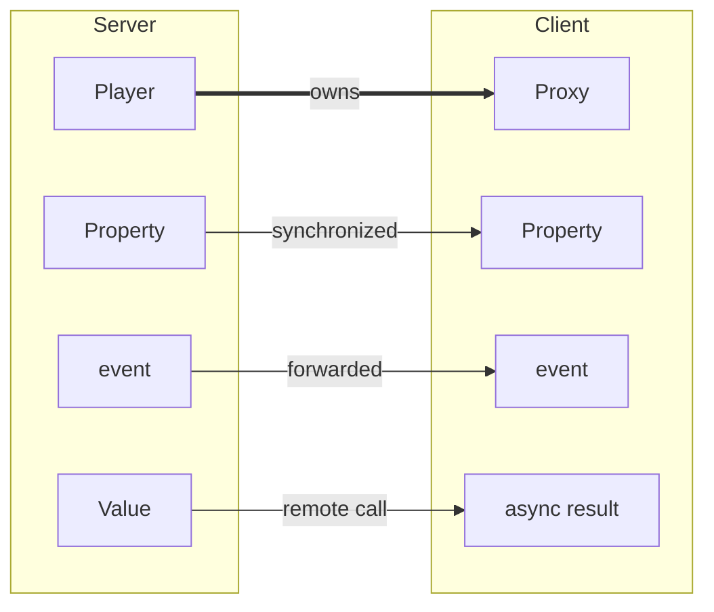

# PinionCore Remote
[](https://codeclimate.com/github/jiowchern/PinionCore.Remote/maintainability)
[](https://github.com/jiowchern/PinionCore.Remote/actions/workflows/dotnet-desktop.yml)
[](https://coveralls.io/github/jiowchern/PinionCore.Remote?branch=master)

[](https://deepwiki.com/jiowchern/PinionCore.Remote)
[](https://discord.gg/XqHghZ4MEc)

> **Use remote C# objects as if they were local.**

PinionCore.Remote is a **Distributed Object Framework** for C# and Unity.

It is built around one simple idea:

> **Distributed programming should feel like ordinary object-oriented programming.**

Instead of exposing remote procedures, you expose remote objects.

Instead of manually synchronizing state, you work with properties.

Instead of maintaining object tables and message dispatchers, you simply use C# interfaces.

No `.proto`.

No DTO mapping.

No message IDs.

Just C# interfaces.

In PinionCore.Remote, such a shared interface is called a **Spirit** — the server incarnates it as a **Soul** (the real object), and the client receives it as a **Ghost** (a live proxy).

```csharp
public interface IPlayer
{
    Property<string> Name { get; }

    Property<int> Hp { get; }

    event Action<int> Damaged;

    Value<bool> Attack(int targetId);
}
```

```csharp
agent.QueryNotifier<IPlayer>().Supply += player =>
{
    Console.WriteLine(player.Name.Value);

    player.Damaged += damage =>
    {
        Console.WriteLine($"-{damage}");
    };

    player.Attack(enemyId);
};
```

When the server creates a player, the client automatically receives it.

When the server destroys it, the client automatically receives `Unsupply`.

The object simply appears and disappears.

---

# Why not RPC?

If you're familiar with **gRPC** or **MagicOnion**, think of PinionCore.Remote as a **Distributed Object Framework**, not an RPC framework.

RPC frameworks expose services.

PinionCore.Remote exposes objects.

|                       | gRPC / MagicOnion             | PinionCore.Remote   |
| --------------------- | ----------------------------- | ------------------- |
| Programming model     | Remote Procedures             | Distributed Objects |
| Contract              | `.proto` or Service Interface | Spirit (plain C# interface) |
| Primary abstraction   | Service                       | Object              |
| State synchronization | Manual                        | `Property<T>`       |
| Server events         | Streaming                     | `event`             |
| Object discovery      | Manual                        | `QueryNotifier<T>`  |
| Object lifetime       | Manual                        | `Supply / Unsupply` |

The goal isn't to make RPC easier.

The goal is to make distributed programming feel like ordinary object-oriented programming.

---

# How it works


```mermaid
flowchart LR
    subgraph Server
        Player["Player"]
        SProp["Property<T>"]
        SEvent["event"]
        SValue["Value<T>"]
    end

    subgraph Client
        Proxy["Proxy"]
        CProp["Property<T>"]
        CEvent["event"]
        CResult["async result"]
    end

    Player ==>|owns| Proxy
    SProp -->|synchronized| CProp
    SEvent -->|forwarded| CEvent
    SValue -->|remote call| CResult
```

The server owns the real object — the **Soul**.

The client owns a live proxy — the **Ghost**.

Both are two incarnations of the same **Spirit**.

Properties stay synchronized.

Events are forwarded automatically.

Method calls become remote invocations.

---

# One entry. The whole contract follows.

Because Notifiers bind recursively, a whole service can hang off a single entry interface.

```csharp
public interface IChatEntry
{
    INotifier<IVerifiable> Verifiables { get; }  // login stage
    INotifier<ILobby> Lobbies { get; }           // after verification
}
```

The server binds one object.

The client makes one query and follows the contract:

```csharp
agent.QueryNotifier<IChatEntry>().Supply += entry =>
{
    entry.Lobbies.Supply += lobby =>
    {
        lobby.Rooms.Supply += room => { /* ... */ };
    };
};
```

The entry interface *is* the client's roadmap — it declares what the service offers at each stage.

And when the contract changes, every consumption site breaks at **compile time**, not silently at runtime.

---

# Ideal for

PinionCore.Remote is well suited for systems where objects naturally have identity, lifetime, and behavior.

* Multiplayer games
* MMO servers
* Distributed simulations
* Digital twins
* Actor-like systems
* Enterprise distributed services
* Object synchronization

---

# Ecosystem

PinionCore.Remote is the foundation of a growing ecosystem.

## PinionCore Gateway

A distributed gateway built entirely on PinionCore.Remote.

It demonstrates that PinionCore.Remote scales beyond simple client/server communication and can be used to build service-oriented distributed architectures.

The gateway itself uses exactly the same public APIs available to every developer—there are no internal shortcuts or special protocols.

Features include:

* Service routing
* Authentication
* Service discovery
* Distributed deployment
* Load balancing

---

# Write distributed software like local software.

You don't manually synchronize objects.

You don't maintain object tables.

You don't implement message dispatchers.

You don't assign message IDs.

You simply work with objects.

---

# Documentation
- [Introduction & Online Docs](docs/readme/en/introduction.md)
- [Core Features](docs/readme/en/core-features.md)
- [Architecture & Module Overview](docs/readme/en/architecture.md)
- [Quick Start (Hello World)](docs/readme/en/quick-start.md)
- [Detailed Core Concepts](docs/readme/en/core-concepts.md)
- [Transport Modes & Standalone](docs/readme/en/transports.md)
- [Advanced Topics](docs/readme/en/advanced-topics.md)
- [Samples, Tests, and Conclusion](docs/readme/en/samples-and-tests.md)
