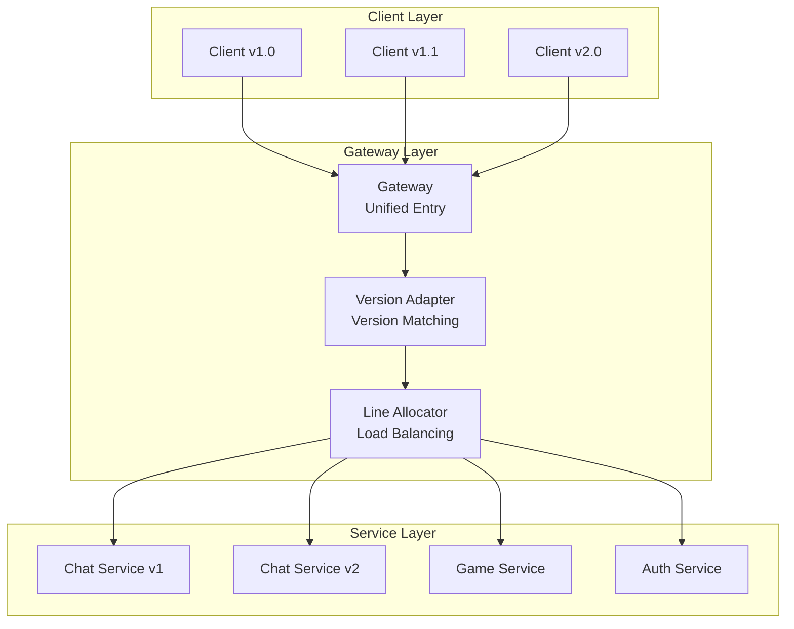

# Core Features

[Back: Introduction](introduction.md) | [Next: Architecture & Modules](architecture.md)

## 1. Interface-Oriented Communication

You only need to define interfaces — no manual serialization or protocol parsing is required:

```csharp
public interface IGreeter
{
    PinionCore.Remote.Value<HelloReply> SayHello(HelloRequest request);
}
```

Server implementation:

```csharp
class Greeter : IGreeter
{
    PinionCore.Remote.Value<HelloReply> IGreeter.SayHello(HelloRequest request)
    {
        return new HelloReply { Message = $"Hello {request.Name}." };
    }
}
```

Client uses `QueryNotifier<IGreeter>()` to get a remote proxy and call it like a local object:

```csharp
agent.QueryNotifier<IGreeter>().Supply += greeter =>
{
    var request = new HelloRequest { Name = "you" };
    greeter.SayHello(request).OnValue += reply =>
    {
        Console.WriteLine($"Receive message: {reply.Message}");
    };
};
```

- `Value<T>` can be awaited or listened through `OnValue`.
- No need to handle connection ID / RPC ID — just follow the interface.

## 2. Controllable Lifecycle (Entry / Session / Soul)

Server implements `IEntry`. Lifecycle callbacks are triggered automatically when sessions open or close:

```csharp
public class Entry : PinionCore.Remote.IEntry
{
    private readonly Greeter _greeter = new Greeter();

    void PinionCore.Remote.ISessionObserver.OnSessionOpened(PinionCore.Remote.ISessionBinder binder)
    {
        // Client connected — bind _greeter
        var soul = binder.Bind<IGreeter>(_greeter);

        // To unbind later:
        // binder.Unbind(soul);
    }

    void PinionCore.Remote.ISessionObserver.OnSessionClosed(PinionCore.Remote.ISessionBinder binder)
    {
        // Cleanup when client disconnects
    }

    void PinionCore.Remote.IEntry.Update()
    {
        // Server update loop (optional)
    }
}
```

Running the server:

```csharp
var host = new PinionCore.Remote.Server.Host(entry, protocol);
// Host internally uses SessionEngine to manage sessions
```

## 3. Value / Property / Notifier Support

PinionCore Remote focuses on interfaces and provides three major member types.

### Value<T>: One-Time Async Call

- Behaves like `Task<T>`.
- Used for request/response flows.
- Set only once; supports both `await` and `OnValue`.

```csharp
Value<LoginResult> Login(LoginRequest request);
```

### Property<T>: Persistent Remote State

- Server maintains the actual value.
- Client gets updates when the value changes.
- Suitable for things like: player name, room title, server version.

```csharp
Property<string> Nickname { get; }
Property<string> RoomName { get; }
```

### Notifier<T>: Dynamic Remote Object Collections

Used to describe dynamic sets of remote objects, suitable for nested structures:

```csharp
public interface IChatEntry
{
    INotifier<IRoom> Rooms { get; }
}

public interface IRoom
{
    Property<string> Name { get; }
    INotifier<IPlayer> Players { get; }
}

public interface IPlayer
{
    Property<string> Nickname { get; }
}
```

Server-side actions:

- Create → `Rooms.Supply(roomImpl)`
- Remove → `Rooms.Unsupply(roomImpl)`
- Player joins → `room.Players.Supply(playerImpl)`
- Player leaves → `room.Players.Unsupply(playerImpl)`

Client:

```csharp
agent.QueryNotifier<IRoom>().Supply += room =>
{
    room.Players.Supply += player =>
    {
        Console.WriteLine($"Player joined: {player.Nickname.Value}");
    };
};
```

**Key points:**

- Notifier = dynamic object collection + remote object tree synchronization
- Client does not manage IDs; everything follows the interface hierarchy

## 4. Reactive Support

`PinionCore.Remote.Reactive` provides Rx (Reactive Extensions) support, allowing you to compose remote workflows using `IObservable<T>`.

Key extension methods (located in `PinionCore.Remote.Reactive.Extensions`):

- `RemoteValue()` — converts `Value<T>` to `IObservable<T>`
- `SupplyEvent()` / `UnsupplyEvent()` — converts `INotifier<T>` events to observables

Example extracted from `PinionCore.Integration.Tests/SampleTests.cs`:

```csharp
var cts = new CancellationTokenSource();
var runTask = Task.Run(async () =>
{
    while (!cts.Token.IsCancellationRequested)
    {
        proxy.Agent.HandlePackets();
        proxy.Agent.HandleMessages();
        await Task.Delay(1, cts.Token);
    }
}, cts.Token);

var echoObs =
    from e in proxy.Agent
        .QueryNotifier<Echoable>()
        .SupplyEvent()
    from val in e.Echo().RemoteValue()
    select val;

var echoValue = await echoObs.FirstAsync();

cts.Cancel();
await runTask;
```

Notes:

- Even when using Rx, **background loops are still required** (`HandlePackets()` / `HandleMessages()` must be called continuously).
- Rx simply makes workflow composition easier; it does not replace low-level message handling.

## 5. Public & Private Interface Support

Since PinionCore Remote is interface-driven, the server can bind different interfaces based on client authentication or permissions, achieving clean “public vs. private” API separation.

```csharp
public interface IPublicService
{
    Value<string> GetPublicData();
}

public interface IPrivateService : IPublicService
{
    Value<string> GetPrivateData();
}

class ServiceImpl : IPrivateService
{
    public Value<string> GetPublicData() => "This is public data.";
    public Value<string> GetPrivateData() => "This is private data.";
}
```

Server-side:

```csharp
void ISessionObserver.OnSessionOpened(ISessionBinder binder)
{
    var serviceImpl = new ServiceImpl();

    if (IsAuthenticatedClient(binder))
    {
        binder.Bind<IPrivateService>(serviceImpl); // authenticated clients
    }

    binder.Bind<IPublicService>(serviceImpl);      // everyone gets this
}
```

- Unauthenticated clients → **IPublicService only**
- Authenticated clients → **IPublicService + IPrivateService**

## 6. Multiple Transport Modes & Standalone

PinionCore Remote includes three built-in transport modes:

### TCP
- `PinionCore.Remote.Server.Tcp.ListeningEndpoint`
- `PinionCore.Remote.Client.Tcp.ConnectingEndpoint`

### WebSocket
- `PinionCore.Remote.Server.Web.ListeningEndpoint`
- `PinionCore.Remote.Client.Web.ConnectingEndpoint`

### Standalone (In-Process Simulation)
- `PinionCore.Remote.Standalone.ListeningEndpoint`
  Acts as both server & client endpoints, ideal for testing

Integration tests (`SampleTests`) launch all three transports and ensure identical behavior across modes.

## 7. Gateway Service

**Purpose**:

`PinionCore.Remote.Gateway` provides enterprise-grade gateway capabilities, serving as a unified entry point for multiple backend services:

- **Multi-Service Routing**: Unified entry point distributing requests to different backend services (Chat, Game, Auth, etc.)
- **Version Coexistence**: Supports multiple protocol versions (`IProtocol.VersionCode`) simultaneously for smooth upgrades
- **Load Balancing**: `LineAllocator` provides service instance allocation and balancing
- **Service Isolation**: Independent deployment and scaling of services, unified management through Gateway

**Architecture Diagram**:



**Core Components**:

- **Router**: Routes requests based on protocol version and service type
- **LineAllocator**: Manages service instance groups, provides load balancing and fault tolerance
- **Version Adapter**: Handles coexistence of clients with different protocol versions, enabling zero-downtime upgrades

**Use Cases**:

- Running multiple independent services simultaneously (microservices architecture)
- Protocol version management and smooth upgrades
- Horizontal scaling and load balancing
- Unified connection management and monitoring entry point

For detailed documentation and examples, see `PinionCore.Remote.Gateway/README.md` and the `PinionCore.Consoles.Chat1.*` projects.
