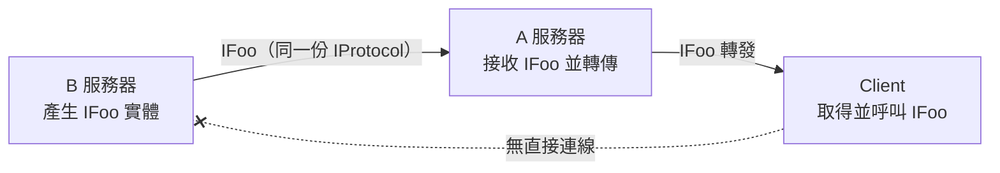
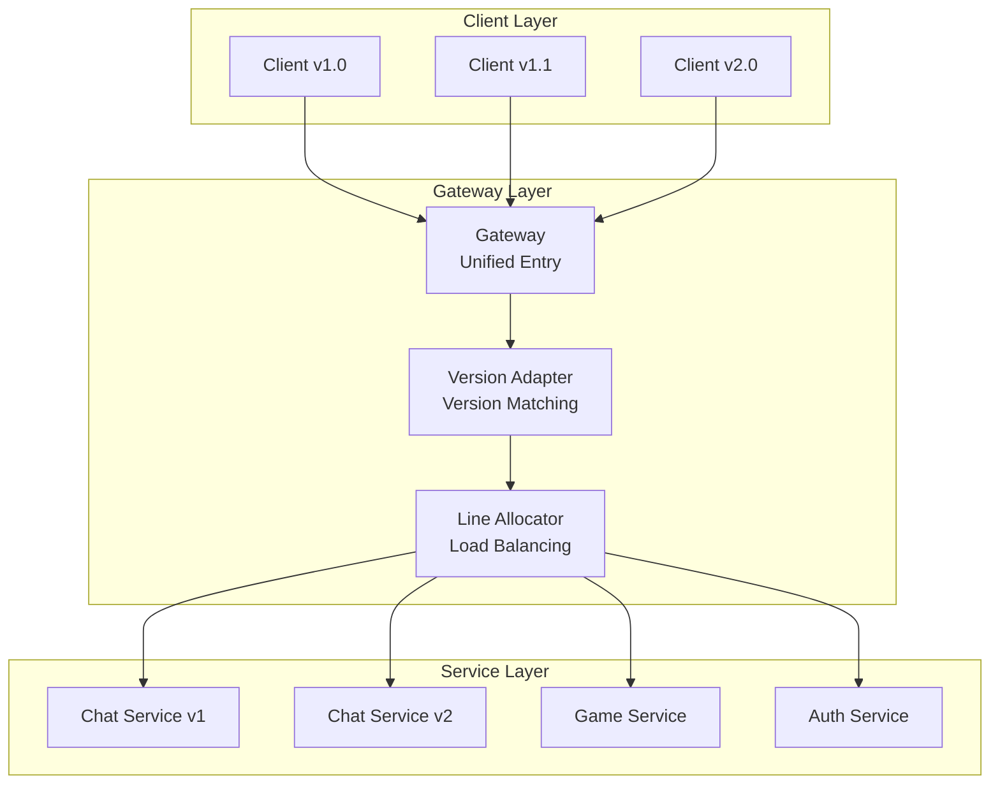

# 核心特色

[上一節：簡介](introduction.md) | [下一節：架構與模組](architecture.md)

## 1. Spirit：介面導向通訊

你只需要定義 **Spirit**——伺服器與客戶端共用的純 C# 介面——不需要手寫序列化或協議解析：

```csharp
public interface IGreeter
{
    PinionCore.Remote.Value<HelloReply> SayHello(HelloRequest request);
}
```

伺服器實作這個介面：

```csharp
class Greeter : IGreeter
{
    PinionCore.Remote.Value<HelloReply> IGreeter.SayHello(HelloRequest request)
    {
        return new HelloReply { Message = $"Hello {request.Name}." };
    }
}
```

客戶端透過 `QueryNotifier<IGreeter>()` 拿到遠端代理，像本地物件一樣呼叫：

```csharp
agent.QueryNotifier<IGreeter>().Supply += greeter =>
{
    var request = new HelloRequest { Name = "you" };
    greeter.SayHello(request).OnValue += reply =>
    {
        Console.WriteLine($"Receive message: {reply.Message}");
    };
};
```

- `Value<T>` 可以 `await`，也可以透過 `OnValue` 事件取得結果。
- 你不需要處理任何連線 ID 或 RPC ID，只要跟著介面走即可。

## 2. 可控的生命週期（Entry / Session / Soul）

伺服器入口實作 `PinionCore.Remote.IEntry`，在連線建立/關閉時由框架呼叫：

```csharp
public class Entry : PinionCore.Remote.IEntry
{
    private readonly Greeter _greeter = new Greeter();

    void PinionCore.Remote.ISessionObserver.OnSessionOpened(PinionCore.Remote.ISessionBinder binder)
    {
        // 客戶端連線 — 綁定 _greeter
        var soul = binder.Bind<IGreeter>(_greeter);

        // 若之後要解除綁定：
        // binder.Unbind(soul);
    }

    void PinionCore.Remote.ISessionObserver.OnSessionClosed(PinionCore.Remote.ISessionBinder binder)
    {
        // 客戶端斷線時需要的清理
    }

    void PinionCore.Remote.IEntry.Update()
    {
        // 伺服器更新迴圈（可選）
    }
}
```

啟動伺服器：

```csharp
var host = new PinionCore.Remote.Server.Host(entry, protocol);
// Host 內部使用 SessionEngine 管理連線
```

## 3. Value / Property / Notifier 支援

### Value<T>：一次性非同步呼叫

- 行為類似 `Task<T>`
- 用於 Request/Response 流程
- 只設定一次，可 `await` 或透過 `OnValue` 取得

```csharp
Value<LoginResult> Login(LoginRequest request);
```

### Property<T>：持續的遠端狀態

- 伺服器維護實際值
- 客戶端在值變更時收到更新
- 適合玩家名稱、房間標題、伺服器版本等

```csharp
Property<string> Nickname { get; }
Property<string> RoomName { get; }
```

### Notifier<T>：動態遠端物件集合

描述巢狀結構或動態集合：

```csharp
public interface IChatEntry
{
    INotifier<IRoom> Rooms { get; }
}

public interface IRoom
{
    Property<string> Name { get; }
    INotifier<IPlayer> Players { get; }
}

public interface IPlayer
{
    Property<string> Nickname { get; }
}
```

伺服器端以 `Depot<T>`（集合＋通知）維護集合。`INotifier<out T>` 是 covariant，
`Depot<Room>` 可直接當作 `INotifier<IRoom>` 曝光（`Room : IRoom`，繼承約束在編譯期檢查）：

```csharp
class ChatEntry : IChatEntry
{
    readonly PinionCore.Remote.Depot<Room> _Rooms = new PinionCore.Remote.Depot<Room>();

    INotifier<IRoom> IChatEntry.Rooms => _Rooms;

    public void AddRoom(Room room) => _Rooms.Items.Add(room);      // 客戶端收到 Supply
    public void RemoveRoom(Room room) => _Rooms.Items.Remove(room); // 客戶端收到 Unsupply
}
```

若協議屬性型別是 `Notifier<T>`（類別）而非 `INotifier<T>`，用 `ToNotifier<T>()` 一行轉出；
同一個 Depot 可依實作的介面產生多個 Notifier（在建構子建立一次並存欄位，不要在 property getter 內呼叫）：

```csharp
_RoomNotifier = _Rooms.ToNotifier<IRoom>();
_RoomViewNotifier = _Rooms.ToNotifier<IRoomView>();
```

客戶端：

```csharp
agent.QueryNotifier<IRoom>().Supply += room =>
{
    room.Players.Supply += player =>
    {
        Console.WriteLine($"Player joined: {player.Nickname.Value}");
    };
};
```

重點：

- Notifier = 動態集合 + 遠端物件樹同步
- 客戶端不需管理 ID，依介面階層即可

## 4. 跨服務器的介面轉傳

由於 PinionCore.Remote 傳輸的是 **Spirit（介面）**而非具體型別，只要 Spirit 來自同一份 `IProtocol`，就能在多個服務器之間轉傳。介面實體可以在某個服務器上產生，交給另一個服務器，再一路轉發到客戶端——實作始終留在原始行程，傳遞的只有介面。

舉例來說，`IFoo` 實體產生於 **B 服務器**，B 服務器把它交給 **A 服務器**，A 服務器再直接轉發給 **Client**。Client 完全不需要連接 B 服務器，卻能透過 A 服務器取得並呼叫 `IFoo`——A 只是擔任介面的中繼。


```mermaid
graph LR
    B["B 服務器<br/>產生 IFoo 實體"]
    A["A 服務器<br/>接收 IFoo 並轉傳"]
    C["Client<br/>取得並呼叫 IFoo"]
    B -- "IFoo（同一份 IProtocol）" --> A
    A -- "IFoo 轉發" --> C
    C -. "無直接連線" .-x B
```

重點：

- 傳輸單位是 Spirit（介面合約），具體實作永遠不需離開原始服務器。
- 只要介面來自同一份 `IProtocol`，就能跨服務器轉傳，完全不需要轉接程式碼。
- 客戶端只需連接一個服務器（A），即可透通地使用來自另一個服務器（B）的介面。
- 不需要包裝、轉接或 DTO 層——每一段轉傳都面對完全相同的介面型別。
- 介面的完整成員都能透通轉傳：**方法**（`Value<T>`）、**屬性**（`Property<T>`，包含 B 端的即時更新一路同步到 Client）、**Notifier**（`Notifier<T>` 物件樹）在中繼節點之間都能正常運作。

> 可執行範例：`PinionCore.Integration.Tests/RelayTests.cs` 建立了完整的 `B → A → Client` 轉傳鏈，並端到端驗證 method、property、notifier 的轉傳。

## 5. 響應式方法支援（Reactive）

`PinionCore.Remote.Reactive` 提供 Rx 擴充，讓你用 `IObservable<T>` 組合遠端流程。

常用擴充（位於 `PinionCore.Remote.Reactive.Extensions`）：

- `RemoteValue()` — 把 `Value<T>` 轉成 `IObservable<T>`
- `SupplyEvent()` / `UnsupplyEvent()` — 把 `INotifier<T>` 事件轉成 Observable

範例（節錄自 `PinionCore.Integration.Tests/SampleTests.cs`）：

```csharp
var cts = new CancellationTokenSource();
var runTask = Task.Run(async () =>
{
    while (!cts.Token.IsCancellationRequested)
    {
        proxy.Agent.HandlePackets();
        proxy.Agent.HandleMessages();
        await Task.Delay(1, cts.Token);
    }
}, cts.Token);

var echoObs =
    from e in proxy.Agent
        .QueryNotifier<Echoable>()
        .SupplyEvent()
    from val in e.Echo().RemoteValue()
    select val;

var echoValue = await echoObs.FirstAsync();

cts.Cancel();
await runTask;
```

注意：

- 即使用 Rx，仍需要背景迴圈呼叫 `HandlePackets()` / `HandleMessages()`。
- Rx 讓流程更容易組合，但不會取代底層訊息處理。

## 6. 簡易的公開與私有介面支援

因為是介面導向，伺服器可以根據權限綁定不同介面，達成 Public/Private API。

```csharp
public interface IPublicService
{
    Value<string> GetPublicData();
}

public interface IPrivateService : IPublicService
{
    Value<string> GetPrivateData();
}

class ServiceImpl : IPrivateService
{
    public Value<string> GetPublicData() => "This is public data.";
    public Value<string> GetPrivateData() => "This is private data.";
}
```

伺服器端：

```csharp
void ISessionObserver.OnSessionOpened(ISessionBinder binder)
{
    var serviceImpl = new ServiceImpl();

    if (IsAuthenticatedClient(binder))
    {
        binder.Bind<IPrivateService>(serviceImpl); // 已驗證
    }

    binder.Bind<IPublicService>(serviceImpl);      // 所有人都能取得
}
```

- 未驗證 → **只有 IPublicService**
- 已驗證 → **IPublicService + IPrivateService**

## 7. 多傳輸模式與 Standalone

- `PinionCore.Remote.Server.Tcp.ListeningEndpoint`
- `PinionCore.Remote.Client.Tcp.ConnectingEndpoint`
- `PinionCore.Remote.Server.Web.ListeningEndpoint`
- `PinionCore.Remote.Client.Web.ConnectingEndpoint`
- `PinionCore.Remote.Standalone.ListeningEndpoint`（同時扮演 Server/Client，適合測試）

整合測試 (`SampleTests`) 會同時跑三種傳輸並驗證行為一致。

## 8. Gateway 閘道服務

`PinionCore.Remote.Gateway` 作為多服務統一入口，提供：

- **多服務路由**：集中入口分發到 Chat/Game/Auth 等後端
- **版本共存**：支援多版本 `IProtocol.VersionCode` 平滑升級
- **負載平衡**：`LineAllocator` 管理服務實例分配
- **服務隔離**：各服務可獨立部署與擴充


```mermaid
graph TB
    subgraph Clients["Client Layer"]
        C1[Client v1.0]
        C2[Client v1.1]
        C3[Client v2.0]
    end

    subgraph Gateway["Gateway Layer"]
        GW[Gateway<br/>Unified Entry]
        VA[Version Adapter<br/>Version Matching]
        LB[Line Allocator<br/>Load Balancing]
    end

    subgraph Services["Service Layer"]
        S1[Chat Service v1]
        S2[Chat Service v2]
        S3[Game Service]
        S4[Auth Service]
    end

    C1 --> GW
    C2 --> GW
    C3 --> GW

    GW --> VA
    VA --> LB

    LB --> S1
    LB --> S2
    LB --> S3
    LB --> S4
```

**核心組件**：

- Router：依協議版本、服務類型路由
- LineAllocator：負載平衡與容錯
- Version Adapter：讓不同版本客戶端共存、升級不中斷

**使用場景**：

- 同時運行多個獨立服務（微服務）
- 協議版本管理與平滑升級
- 橫向擴展與負載平衡
- 統一的連線管理與監控入口

更多說明與範例：`PinionCore.Remote.Gateway/README.md`、`PinionCore.Consoles.Chat1.*`。
